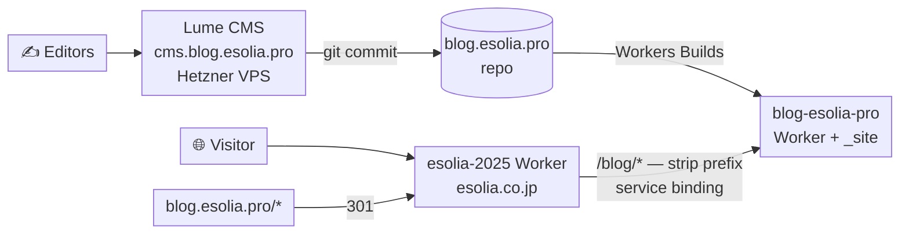

# Consolidating the blog onto `esolia.co.jp/blog`

**Status:** in progress (blog side) · **Date:** 2026-09-19 · **Repos:**
`blog.esolia.pro`, `esolia-2025`

Move the blog from `blog.esolia.pro` to `esolia.co.jp/blog` by edge-routing the
**existing Lume build** from the main site's Worker. No site rewrite, no CMS
change, no content migration. The editors keep Lume CMS on the Hetzner VPS and
should notice nothing.

## Decision

The goal is SEO consolidation: link equity on one hostname instead of split
across two. After [#351](https://github.com/eSolia/esolia-2025/issues/351) (Bing
indexing `esolia-2025.esolia.workers.dev` as a duplicate), running fewer
distinct hostnames is the right direction.

The key realization is that this is a **routing problem, not a rewrite
problem**. `_config.ts` already loads `lume/plugins/base_path.ts`, whose entire
purpose is deploying a Lume site under a subdirectory. It is currently a no-op
because `location` has no path. Give `location` a `/blog` path and it starts
prefixing every root-relative URL in the built HTML.

### Alternatives considered

| Option                                        | Verdict                                                                                                                                                                                                                            |
| --------------------------------------------- | ---------------------------------------------------------------------------------------------------------------------------------------------------------------------------------------------------------------------------------- |
| **Edge-route Lume under `/blog`** (this plan) | **Chosen.** Days of work. Reversible.                                                                                                                                                                                              |
| Move to `blog.esolia.co.jp`                   | Works, but forfeits apex consolidation — the whole point.                                                                                                                                                                          |
| Rewrite the blog in SvelteKit at `/blog`      | Real rationale (esolia.co.jp is already SvelteKit), but the cost is the generator: templates, markdown pipeline, multilanguage routing, feeds, pagination, date gating. Not now.                                                   |
| Replace Lume CMS with Sveltia                 | Attractive — client-side only, retires the Hetzner VPS. But its preview pane is a hand-written client-side approximation, not the real site, and the `translate-button` / `translation-clipboard` extensions would need rewriting. |
| Add website-CMS features to Hanawa            | Strategically the most interesting: same stack as esolia-2025, owned in-house. But it is a product build (TipTap rich text, D1-backed, v0.9.0), and it moves content out of git.                                                   |
| Adopt em-dash                                 | Proven at jac-help, but a young third-party dependency (0.30.0, Astro-oriented) with the same D1-backed content model as Hanawa, which we own. No advantage.                                                                       |

### Why sequencing matters

Because the 90 posts stay as **markdown in git**, the CMS remains disposable —
swappable at any time with zero content migration. Migrating into D1 (Hanawa or
em-dash) is a one-way door.

This plan fixes the **URLs** now. Once they are final, any later generator or
CMS change is a swap of what serves those paths — no redirects, no second SEO
event, and abortable back to Lume at any point. Do not spend that option early.

## Architecture (after)



Unchanged: the CMS, the VPS, `cms.git()`, Cloudflare Access, Workers Builds, and
the nightly cron. The only difference is how the built output is _reached_.

## Change set — `blog.esolia.pro`

**1. `_config.ts` — the base path**

```ts
location: new URL("https://esolia.co.jp/blog"),
```

`base_path` (line 191) then prefixes root-relative URLs in the output. `metas()`
runs after it (line 244), so canonicals and hreflang inherit the new base.

Note this does **not** restructure `_site/` — output stays at `posts/foo/`, not
`blog/posts/foo/`. The `/blog` prefix is stripped at the edge (see below).

**2. `worker/index.ts` — hardcoded origins**

`base_path` cannot see Worker code. Two constants break:

- **Line 165, `ALLOWED_ORIGINS`** — currently `{"https://blog.esolia.pro"}`.
  Post-move the browser sends `Origin: https://esolia.co.jp`, failing the check
  and returning `Forbidden` (line 193). **This silently kills newsletter
  signup.** Add the new origin.
- **Lines 151–162, `LOCALES`** — `thanks` and `home` are absolute
  `https://blog.esolia.pro/...` URLs. Post-move a signup bounces the user back
  to the old host and through the 301. Update to the `/blog` paths.

**3. `<form action>` — no change needed.** `base_path` rewrites it; verified in
the build. See "Open questions — answered" below.

**4. Four post-`base_path` gaps** — the font CSS `sed` scripts, the Pagefind
`type="module"` selector, the static `manifest.json`, and `externalLinksIcon`'s
hardcoded origin. Found by building; all fixed on the branch. See "Found while
building" below.

## Change set — `esolia-2025`

**1. Service binding** in `wrangler.jsonc`:

```jsonc
"services": [{ "binding": "BLOG", "service": "blog-esolia-pro" }]
```

A service binding rather than a Worker route. `esolia.co.jp` is bound to
esolia-2025 as a **Custom Domain** — confirmed 2026-09-19 via
`GET /accounts/{account_id}/workers/domains?service=esolia-2025`, which returns
only Custom Domains; Worker routes live under `/zones/{zone_id}/workers/routes`.
A Custom Domain captures the whole hostname, so an overlapping
`esolia.co.jp/blog*` route is not an option. The binding is also the better
design regardless: it keeps the blog origin off the public internet and avoids
an extra network hop.

The only route on the `esolia.co.jp` zone is `api.esolia.co.jp/contact-submit` →
`esolia-contact-form`, on a different hostname. Nothing claims `/blog`.

**2. Forwarder** for `/blog/*`, **stripping the prefix** before dispatch. The
blog Worker's assets are rooted at `/`, so `/blog/posts/foo/` must arrive as
`/posts/foo/`.

The assets config has no `run_worker_first`, so `/blog/*` matches no asset and
falls through to the Worker; that path is not prerendered, so the "prerendered
pages bypass `hooks.server.ts`" caveat from #351 does not apply. The blog Worker
does its own dispatch and falls through to `env.ASSETS.fetch(request)`
(`worker/index.ts:86`), so both `/api/*` and static assets resolve correctly
over the binding.

**3. `robots.txt` route** — add a second sitemap directive:

```
Sitemap: https://esolia.co.jp/blog/sitemap.xml
```

**4. Remove the `/blog` → `blog.esolia.pro` redirect — this one is a blocker.**
Found while implementing; the plan had missed it entirely.
`src/lib/content/redirects.ts` already maps `/blog` and `/blog/` to
`https://blog.esolia.pro`. Combined with the new Redirect Rule on that zone,
which sends `/*` straight back to `esolia.co.jp/blog/*`, that is an **infinite
redirect loop** on the blog's own front door. The forwarder dispatches ahead of
the redirect map, so it wins either way — but the entries are removed rather
than shadowed, because a stale rule that is only harmless by accident of
ordering is a trap. The sibling legacy paths (`/post/`, `/posts/`, `/en/post/`,
`/en/posts/`, `/en/blog`, `/en/blog/`, and the `/post/*`/`/posts/*` prefix rule)
pointed at the old host too; they now redirect internally to `/blog/` and
`/blog/en/`, one hop instead of two.

**5. Repoint this repo's own links to the blog.** Nav (`TopNav`, `MobileMenu`),
footer (`i18n/translations.ts`), homepage (`LatestBlogPosts`), article pages
(`RelatedBlogPosts`), the 404 page (`+error.svelte`), the WebMCP tool
descriptions, and the build-time feed fetch in `scripts/fetch-blog.mts`. The
three explicit `trackOutbound('blog.esolia.pro')` calls go with them: those
links are same-origin now, so the events were simply false, and the global
outbound tracker in `+layout.svelte` already stops firing for them by itself.

Note the links keep `target="_blank"`. That is now load-bearing rather than
cosmetic: `/blog/*` is served by another Worker and is not a SvelteKit route, so
these must be full page loads, not client-side navigations.

## Manual work — not code, will not arrive via a PR

Everything in this section has to be done by hand in a dashboard or console.
None of it is covered by the two implementation PRs, and two items are
**blocking**: the deploy order and the Redirect Rule.

### Deploy order (do not reorder)

The two PRs are safe to merge in either order, but they must **deploy** in this
one. Between steps 1 and 2 the blog is briefly broken at both hostnames — pick a
quiet window and keep the gap short.

1. **Deploy the blog side** (`blog.esolia.pro` PR #317). Its output now carries
   `/blog`-prefixed URLs, so `blog.esolia.pro` itself starts serving pages whose
   assets and links point at a path that host does not have. Expected, and the
   reason not to sit here.
2. **Deploy the esolia-2025 side** (#499). `esolia.co.jp/blog/*` starts working.
   Verify it before step 3 — this is the last point where rollback costs
   nothing.
3. **Add the Redirect Rule** (below). Old URLs start funnelling to the new ones.

Rolling back is the same list in reverse; see **Rollback**.

### 1. Cloudflare — Redirect Rule on the `blog.esolia.pro` zone

Redirect rules run before Workers in the request pipeline, so this takes
precedence over the blog Worker still bound to that hostname.

```
blog.esolia.pro/*  →  https://esolia.co.jp/blog/$1     301, preserve query
```

Paths map 1:1, so this is a pure prefix addition. Keep it permanently — it is
the primary SEO signal for the move, not a temporary measure.

**Do not add this before step 2.** With the old `/blog` → `blog.esolia.pro`
redirect that used to live in esolia-2025's redirect map, this rule would have
formed an infinite loop; #499 removes that entry, so the loop is gone, but the
rule still needs the forwarder live or every old URL lands on a 404.

### 2. Cloudflare — cache

Purge the `esolia.co.jp` cache after step 2 so the edge is not holding a 404 for
`/blog/*` from before the forwarder existed.

### 3. dbFlex / PROdb

- **Newsletter email templates.** The verify and unsubscribe links are absolute
  `blog.esolia.pro` URLs. They keep working through the 301 (they are GETs), so
  this is a hop to remove rather than a break — but the whole point of the move
  is not to depend on the old hostname. Repoint to
  `https://esolia.co.jp/blog/api/newsletter/{verify,unsubscribe}?guid=…`.
- **The blog-launch news item** (app 15331, webinfo). Its ja and en text both
  link to `https://blog.esolia.pro`. It reaches the site through
  `src/_data/_tdcache/webinfo.json`, which `pnpm generate:prodb` regenerates
  from dbFlex, so editing the repo copy is pointless — fix it at source.

### 4. Google Search Console

- **Keep the `blog.esolia.pro` property.** It is how the old URLs are watched as
  they drain; do not delete it.
- **Submit `https://esolia.co.jp/blog/sitemap.xml`** under the `esolia.co.jp`
  property.
- **Try the Change of Address tool**, expecting it to refuse. It is built for
  domain-to-domain moves and will most likely reject a subdirectory target. The
  301s are the primary signal and are sufficient on their own.
- Optionally do the same sitemap submission in **Bing Webmaster Tools** — Bing
  is what surfaced the duplicate-hostname problem in
  [esolia-2025#351](https://github.com/eSolia/esolia-2025/issues/351).

### 5. Decisions to make deliberately, not by default

- **Content-Signal and bot policy.** Once the blog is served from this origin,
  `esolia.co.jp/robots.txt` governs it and the blog's own robots.txt (at
  `/blog/robots.txt`) is inert. That means esolia-2025's
  `Content-Signal: search=yes, ai-input=yes, ai-train=no`, its
  `Applebot-Extended` / `Bytespider` / `CCBot` / `Google-Extended` /
  `meta-externalagent` / `cohere-ai` blocks, and its
  `Disallow: /technical/security-acknowledgments/` now all apply to blog
  content. Probably desirable — but confirm it is what you want for the blog,
  because it is a policy change smuggled in by a routing change.
- **Content-Security-Policy.** #499 returns the blog's response unmodified, so
  blog pages keep the blog's own `_headers` and get **no CSP**, exactly as today
  at `blog.esolia.pro`. No regression, but now that they are served from
  `esolia.co.jp` the inconsistency is more visible. Applying esolia-2025's CSP
  to them looks feasible on paper — `cdn.jsdelivr.net`, `cdn.usefathom.com` and
  `challenges.cloudflare.com` are already allowed, Pagefind needs
  `'wasm-unsafe-eval'` which is present, and the newsletter form action is
  `'self'` — but it would need real browser testing of search, Turnstile and
  signup before being switched on. Deliberately deferred.
- **`target="_blank"` on the blog links.** The nav, footer, homepage and
  related-posts links to the blog still open in a new tab and are still flagged
  `external`, which is now factually wrong but is also load-bearing: `/blog/*`
  is another Worker's, not a SvelteKit route, so those clicks must be full page
  loads rather than client-side navigations. Changing the presentation is a UX
  call; if you do, keep the full page load (`data-sveltekit-reload`).

### 6. Analytics — verify, probably nothing to do

Fathom site `OIXGEUHR` (the blog) is keyed by site ID in the page, not by
hostname, so blog pageviews keep landing in the blog's own Fathom site even
though they now arrive as `esolia.co.jp/blog/*`. Two things to be aware of
rather than fix:

- Reported paths change from `/posts/x` to `/blog/posts/x`, so historical path
  comparisons in that site break at the cutover.
- If that Fathom site has a domain restriction configured, add `esolia.co.jp`.

The explicit `Outbound: blog.esolia.pro` events are removed in #499 — they were
firing on what are now same-origin links, and the global outbound tracker in
`+layout.svelte` correctly stops firing for them on its own.

### Verified live against the #500 preview deployment (2026-09-19)

The Cloudflare preview build for #500 carries the real service binding, so the
routing half was tested end to end before either side merged. The blog Worker in
production still emits unprefixed URLs — #317 is not deployed — so pages come
back correct but unstyled, which is itself the deploy-order dependency made
visible.

| Request                                          | Result                                                            |
| ------------------------------------------------ | ----------------------------------------------------------------- |
| `/blog/`                                         | 200, `ホーム - Tech It Easy Blog` — binding and prefix strip work |
| `/blog`                                          | 301 → `/blog/`, same origin, no loop                              |
| `/blog/en/posts/20180416-telework-offensive_en/` | 200                                                               |
| `/blog/posts/20180416-%E6%94%BB…-ja/`            | 200 — percent-encoded ja path survives the strip                  |
| `/blog/fonts-ja.css`                             | 200 `text/css` — assets resolve over the binding                  |
| `/blog/sitemap.xml`, `/blog/feed.ja.xml`         | 200 `application/xml`                                             |
| `/blog/no-such-page/`                            | 404 from the blog's own handler                                   |
| `/blogging/`                                     | 404 from esolia-2025 — not captured by the forwarder              |

**A gate nobody had written down: SvelteKit's CSRF protection now sits in front
of the blog.** It rejects any cross-origin POST _before_ `hooks.server.ts` runs,
so it applies to `/blog/api/*` too. Proven by the two error messages being
distinguishable:

- `Origin` ≠ app origin → `Cross-site POST form submissions are forbidden`
  (SvelteKit; the forwarder never ran)
- `Origin` = app origin → `Forbidden` (the blog Worker's own allowlist check,
  reached with method and `Origin` intact)

Two consequences:

- **The newsletter POST works in production**, where the page is at
  `esolia.co.jp/blog/…` and posts to the same origin. Both gates pass.
- **The blog's `ALLOWED_ORIGINS` entry for the old host is not a transition
  safety net**, as it was originally described. A forwarded POST carrying
  `Origin: https://blog.esolia.pro` is stopped by SvelteKit first. The entry
  still earns its place for requests that hit the blog Worker _directly_ — every
  request until the Redirect Rule goes live, and again during a rollback — so it
  stays, with the comment in `worker/index.ts` corrected.

Not tested, and not testable without deploying: the end-to-end signup, double
opt-in and unsubscribe, which need the blog's new `esolia.co.jp` origin
allowlist live.

### 7. Checked — nothing to do

- **Turnstile.** The `blog-esolia-pro-newsletter` widget enforces a hostname
  allowlist and post-move renders on `esolia.co.jp` pages. A missing hostname
  would have failed siteverify and blocked **every** signup, with the same
  silent signature as the `ALLOWED_ORIGINS` bug. Verified via
  `GET /accounts/{account_id}/challenges/widgets`: its domains are already
  `blog.esolia.pro`, `esolia.co.jp`, `localhost`.
- **IndexNow.** The key file is served at `/blog/f36d….txt`, and IndexNow
  accepts a key hosted in a subdirectory as authorization for URLs in that
  subdirectory — so it still covers `esolia.co.jp/blog/*`.

## SEO plan

**Sitemaps do not need merging.** A sitemap is authoritative for its own
directory and below, so `esolia.co.jp/blog/sitemap.xml` — which Lume already
generates and will keep current as posts are published — correctly covers
`esolia.co.jp/blog/*`. esolia-2025's `sitemap.xml` is a flat hand-maintained
`<urlset>`; merging 90 bilingual posts into it would mean building a cross-repo
sync. Don't. Announce the blog sitemap via robots.txt and Search Console
instead.

**robots.txt is read only at the origin root.** After the move,
`esolia.co.jp/robots.txt` governs the whole origin including `/blog`, and the
blog's own robots.txt — served at `esolia.co.jp/blog/robots.txt` — is ignored by
crawlers. Two consequences:

- The blog's `Sitemap:` line goes dead; hence the directive added above.
- esolia-2025's Content-Signal policy (`ai-train=no`), the Applebot-Extended
  block, and the rest now apply to blog content. Probably desirable, but it is a
  policy change to make **deliberately**.

**Telling Google.** The Change of Address tool is built for domain-to-domain
moves and will most likely reject a subdirectory target — try it, but plan on
not having it. The **301s are the primary signal and are sufficient**. Then:

- Keep the `blog.esolia.pro` Search Console property. It is how the old URLs are
  watched as they drain.
- Submit `https://esolia.co.jp/blog/sitemap.xml` under the esolia.co.jp
  property.
- Verify canonicals and the ja↔en hreflang `alternate` pairs in the built
  output. They derive from `location` and should update automatically — confirm
  rather than assume, given #351.
- Feeds (`/feed.ja.xml`, `/feed.en.xml`, and the JSON pair) regenerate with new
  absolute URLs. Existing subscribers follow the 301; a few readers handle
  redirects badly.
- Update any esolia.co.jp → blog.esolia.pro internal links to the new paths
  directly, rather than through the hop.

**Expectations.** For 90 posts, allow weeks to a couple of months for Google to
recrawl and consolidate, with a possible temporary dip. Normal for a site move;
the 301s preserve the equity.

## Settled before branching

Answerable by inspection; confirmed 2026-09-19:

- **`esolia.co.jp` is a Custom Domain** bound to esolia-2025, and no Worker
  route on that zone claims `/blog` (the only zone route is
  `api.esolia.co.jp/contact-submit`). The service binding is therefore required,
  not merely preferred. See the service-binding section above.
- **esolia-2025's robots.txt already emits**
  `Sitemap: https://esolia.co.jp/sitemap.xml`. Add a second directive for the
  blog sitemap; do not replace.

## Open questions — answered on the branch (2026-09-19)

Both resolved by setting `location` to `https://esolia.co.jp/blog` and building.
Evidence below; both answers are **no further work required**.

**1. Does `base_path` rewrite `<form action>`? — Yes. Change #3 is dropped.**

`base_path` delegates to `modify_urls`, whose link scanner
(`core/utils/dom_links.ts`) carries `action: "form[action]"` in its selector
table alongside `href`, `src`, `poster` and the two `srcset` variants. So the
form action is rewritten like any other root-relative URL.

Confirmed in the build — the only `action="/…"` in the whole of `_site/`:

```
$ grep -rhoE 'action="/[^"]*"' --include="*.html" _site/ | sort -u
action="/blog/api/newsletter"
```

The newsletter form appears on `index.html` and `en/index.html` only, and both
post to `/blog/api/newsletter`. No hardcoded action needed.

**2. Does `lume -s` already override `location`? — Yes. No `LUME_LOCATION` env
var needed, and none was built.**

`getOptionsFromCli` (`core/utils/cli_options.ts`) branches on `--serve`/`-s`. In
serve mode it **unconditionally** assigns
`options.location = new URL("http://" + hostname + ":" + port)` unless an
explicit `--location` is passed, discarding whatever `_config.ts` set. In build
mode it keeps the config value. The working-tree `_site/robots.txt` reading
`Sitemap: http://127.0.0.1:3000/sitemap.xml` was exactly this.

So under `deno task cms` the base path is empty, preview is served from the
server root, and `base_path` stays a no-op — the CMS preview is unaffected by
this change and the systemd unit needs no edit.

## Found while building — six things the plan missed

Setting `location` exposed six places the `/blog` prefix does not reach on its
own. All are blog-side and all are fixed on this branch. Four are regressions
the location change itself causes; the rest are stale constants.

1. **Font CSS — every web font 404s.** `googleFonts` emits relative
   `url("fonts-en/…")`, which `base_path` skips (it only rewrites URLs starting
   with `/`). Two `afterBuild` `sed` scripts then made them root-absolute
   `/fonts-en/…` — but `afterBuild` runs long after `base_path`, so the prefix
   was never applied. Replaced with a `site.process([".css"])` step registered
   **before** `basePath()`, so `base_path` does the prefixing. This also drops
   the hardcoded `_site/` path and the darwin/linux `sed` divergence.

2. **Pagefind — site search breaks.** The step that adds `type="module"` to
   Pagefind's UI script selects on `script[src="/pagefind/pagefind-ui.js"]` and
   runs after `base_path`, by which point the src is `/blog/pagefind/…`. The
   selector silently matched nothing and the script loaded as a classic script,
   which is the exact "Cannot use import statement outside a module" failure the
   step exists to prevent. Selector now derives from `site.url()`.

3. **PWA manifest — icons 404, `start_url` leaves the blog.** `manifest.json` is
   a static copy, and `modify_urls` only touches `.html` and `.css`, so its
   `start_url: "/"` and `/favicon.svg`-style icon paths stayed root-absolute —
   resolving against `esolia.co.jp/` rather than `esolia.co.jp/blog/`. Paths
   made relative to the manifest's own URL instead, which resolves correctly at
   either location and needs no build machinery.

4. **The Worker's own rendered HTML — double opt-in and unsubscribe break.**
   `base_path` cannot see Worker code, and beyond the two constants the plan
   identified, `renderConfirmPage` emits
   `<form method="POST" action="/api/newsletter/{op}">`. That page is served at
   `esolia.co.jp/blog/api/newsletter/verify`, so a root-relative action resolves
   to `esolia.co.jp/api/newsletter/verify` — esolia-2025, not the blog. The
   confirm button 404s, which breaks double opt-in and unsubscribe. Same for
   that page's ``. Both now go through a `PUBLIC_BASE`
   constant, which the `LOCALES` values are built from too.

5. **`externalLinksIcon("https://blog.esolia.pro")`** still named the old
   origin, so post-move it would mark same-site links external and
   `esolia.co.jp` links internal. Now read from `site.options.location`. Note it
   compares hostname only, so `esolia.co.jp/info-request/` stops getting the
   external-link arrow — correct, it is the same site now.

6. **Stale self-references.** Six posts cross-link to other posts as absolute
   `blog.esolia.pro` URLs (made root-relative, which also stops them rendering
   with the external-link arrow); `reference`/`thanks_url` in both `i18n.yml`
   files, which are dead keys superseded by the Worker's `LOCALES`; and
   `_cms.ts`'s site URL, the "view site" link editors click out of Lume CMS.

### Checked and deliberately unchanged

- **`_site/_headers`** keeps its root-relative patterns (`/fonts-*/*`,
  `/assets/*`, `/uploads/*`). The prefix is stripped before the blog Worker
  dispatches, so its asset handler still sees unprefixed paths.
- **`wrangler.jsonc`'s `run_worker_first: ["/api/*"]`**, for the same reason.
- **The Worker's own route matching** (`url.pathname === "/api/newsletter"`),
  for the same reason. The asymmetry is the whole point of `PUBLIC_BASE`: what
  the Worker _receives_ is unprefixed, what it _emits_ is not.

### Also verified — no action needed

**Turnstile.** The `blog-esolia-pro-newsletter` widget enforces a hostname
allowlist, and post-move it renders on `esolia.co.jp` pages — a missing hostname
would have failed siteverify and blocked every signup, with the same
silent-failure signature as the `ALLOWED_ORIGINS` bug. Checked via
`GET /accounts/{account_id}/challenges/widgets`: its domains are already
`blog.esolia.pro`, `esolia.co.jp`, `localhost`. Nothing to do, but it was a live
dependency and the plan did not list it.

### Out of repo — still to do

The **verify/unsubscribe links in the dbFlex/PROdb email templates** are
absolute `blog.esolia.pro` URLs. They keep working through the 301 (they are
GETs), so this is not urgent, but they should be repointed to avoid the hop.
Dashboard work, like the Redirect Rule.

## Verification

Confirmed in the local build output on this branch — these are the items that
can be checked before anything is deployed:

- [x] Canonical and hreflang on a ja post and its en twin point to
      `esolia.co.jp/blog/…`
- [x] `sitemap.xml` carries absolute `esolia.co.jp/blog/*` `<loc>` and
      `xhtml:link` pairs
- [x] Feeds carry absolute `esolia.co.jp/blog/*` URLs
- [x] The blog's own `robots.txt` points at
      `https://esolia.co.jp/blog/sitemap.xml` (dead once served under /blog —
      hence the esolia-2025 directive)
- [x] Newsletter `<form action>` is `/blog/api/newsletter`, on both pages that
      carry the form
- [x] Assets, icons and favicons resolve under `/blog/`
- [x] Font CSS references `/blog/fonts-{en,ja}/…`
- [x] Pagefind's UI script keeps its `type="module"`
- [x] No `blog.esolia.pro` anywhere in the built HTML
- [x] Turnstile widget hostnames already include `esolia.co.jp`

Needs the deploy and the esolia-2025 side:

- [ ] `esolia.co.jp/blog/` and a deep post URL render with correct CSS and
      images
- [ ] `blog.esolia.pro/<path>` 301s to `esolia.co.jp/blog/<path>`, query
      preserved
- [ ] Newsletter signup completes end-to-end from an `esolia.co.jp` page
- [ ] Double opt-in **and** unsubscribe complete end-to-end — the confirm-page
      form action was broken and is easy to miss, since the signup path works
      without it
- [ ] `esolia.co.jp/blog/sitemap.xml` is reachable and matches the above
- [ ] `esolia.co.jp/robots.txt` lists both sitemaps
- [ ] PWA manifest installs with the right icons and a `/blog/` start URL
- [ ] CMS preview at `cms.blog.esolia.pro` still renders correctly
- [ ] CI green in both repos; no new Dependabot alerts

## Rollback

Every step is reversible and none touches content. Reverse the deploy order:

1. **Delete the Redirect Rule** first, so `blog.esolia.pro` starts serving again
   instead of bouncing to a path that is about to stop working.
2. **Disable the `/blog/*` forwarder** in esolia-2025 (or remove the binding).
3. **Revert `location` in `_config.ts`** and redeploy — `base_path` returns to a
   no-op and the output is byte-for-byte what it is today.

Reverting the two PRs is enough for steps 2 and 3; step 1 is dashboard work.

Two things do not roll back automatically and are worth knowing before starting,
though neither is damaging:

- **Google will have seen the 301s.** Undoing them after more than a few days
  means a second move as far as search engines are concerned. The window for a
  free rollback is short — hours, not weeks. This is the real reason to verify
  at step 2 of the deploy order, before the Redirect Rule goes live.
- **PROdb newsletter records** created after the cutover carry the new
  `reference` URL. Harmless — it is a stored provenance field, not a link
  anything follows.

The markdown never moved, so there is nothing to migrate back.
