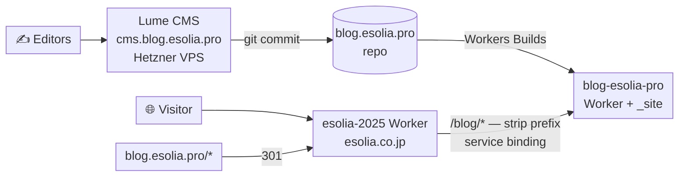

# Consolidating the blog onto `esolia.co.jp/blog`

**Status:** proposed · **Date:** 2026-09-19 · **Repos:** `blog.esolia.pro`,
`esolia-2025`

Move the blog from `blog.esolia.pro` to `esolia.co.jp/blog` by edge-routing the
**existing Lume build** from the main site's Worker. No site rewrite, no CMS
change, no content migration. The editors keep Lume CMS on the Hetzner VPS and
should notice nothing.

## Decision

The goal is SEO consolidation: link equity on one hostname instead of split
across two. After [#351](https://github.com/eSolia/esolia-2025/issues/351) (Bing
indexing `esolia-2025.esolia.workers.dev` as a duplicate), running fewer
distinct hostnames is the right direction.

The key realization is that this is a **routing problem, not a rewrite
problem**. `_config.ts` already loads `lume/plugins/base_path.ts`, whose entire
purpose is deploying a Lume site under a subdirectory. It is currently a no-op
because `location` has no path. Give `location` a `/blog` path and it starts
prefixing every root-relative URL in the built HTML.

### Alternatives considered

| Option                                        | Verdict                                                                                                                                                                                                                            |
| --------------------------------------------- | ---------------------------------------------------------------------------------------------------------------------------------------------------------------------------------------------------------------------------------- |
| **Edge-route Lume under `/blog`** (this plan) | **Chosen.** Days of work. Reversible.                                                                                                                                                                                              |
| Move to `blog.esolia.co.jp`                   | Works, but forfeits apex consolidation — the whole point.                                                                                                                                                                          |
| Rewrite the blog in SvelteKit at `/blog`      | Real rationale (esolia.co.jp is already SvelteKit), but the cost is the generator: templates, markdown pipeline, multilanguage routing, feeds, pagination, date gating. Not now.                                                   |
| Replace Lume CMS with Sveltia                 | Attractive — client-side only, retires the Hetzner VPS. But its preview pane is a hand-written client-side approximation, not the real site, and the `translate-button` / `translation-clipboard` extensions would need rewriting. |
| Add website-CMS features to Hanawa            | Strategically the most interesting: same stack as esolia-2025, owned in-house. But it is a product build (TipTap rich text, D1-backed, v0.9.0), and it moves content out of git.                                                   |
| Adopt em-dash                                 | Proven at jac-help, but a young third-party dependency (0.30.0, Astro-oriented) with the same D1-backed content model as Hanawa, which we own. No advantage.                                                                       |

### Why sequencing matters

Because the 90 posts stay as **markdown in git**, the CMS remains disposable —
swappable at any time with zero content migration. Migrating into D1 (Hanawa or
em-dash) is a one-way door.

This plan fixes the **URLs** now. Once they are final, any later generator or
CMS change is a swap of what serves those paths — no redirects, no second SEO
event, and abortable back to Lume at any point. Do not spend that option early.

## Architecture (after)



Unchanged: the CMS, the VPS, `cms.git()`, Cloudflare Access, Workers Builds, and
the nightly cron. The only difference is how the built output is _reached_.

## Change set — `blog.esolia.pro`

**1. `_config.ts` — the base path**

```ts
location: new URL("https://esolia.co.jp/blog"),
```

`base_path` (line 191) then prefixes root-relative URLs in the output. `metas()`
runs after it (line 244), so canonicals and hreflang inherit the new base.

Note this does **not** restructure `_site/` — output stays at `posts/foo/`, not
`blog/posts/foo/`. The `/blog` prefix is stripped at the edge (see below).

**2. `worker/index.ts` — hardcoded origins**

`base_path` cannot see Worker code. Two constants break:

- **Line 165, `ALLOWED_ORIGINS`** — currently `{"https://blog.esolia.pro"}`.
  Post-move the browser sends `Origin: https://esolia.co.jp`, failing the check
  and returning `Forbidden` (line 193). **This silently kills newsletter
  signup.** Add the new origin.
- **Lines 151–162, `LOCALES`** — `thanks` and `home` are absolute
  `https://blog.esolia.pro/...` URLs. Post-move a signup bounces the user back
  to the old host and through the 301. Update to the `/blog` paths.

**3. Verify `<form action>`** in the built HTML. If `base_path` does not rewrite
form actions, the newsletter form on a page at `esolia.co.jp/blog/...` posts to
`/api/newsletter`, which lands on esolia-2025 rather than the blog. If so,
hardcode the action to `/blog/api/newsletter`.

## Change set — `esolia-2025`

**1. Service binding** in `wrangler.jsonc`:

```jsonc
"services": [{ "binding": "BLOG", "service": "blog-esolia-pro" }]
```

A service binding rather than a Worker route. `esolia.co.jp` is bound to
esolia-2025 as a **Custom Domain** — confirmed 2026-09-19 via
`GET /accounts/{account_id}/workers/domains?service=esolia-2025`, which returns
only Custom Domains; Worker routes live under `/zones/{zone_id}/workers/routes`.
A Custom Domain captures the whole hostname, so an overlapping
`esolia.co.jp/blog*` route is not an option. The binding is also the better
design regardless: it keeps the blog origin off the public internet and avoids
an extra network hop.

The only route on the `esolia.co.jp` zone is `api.esolia.co.jp/contact-submit` →
`esolia-contact-form`, on a different hostname. Nothing claims `/blog`.

**2. Forwarder** for `/blog/*`, **stripping the prefix** before dispatch. The
blog Worker's assets are rooted at `/`, so `/blog/posts/foo/` must arrive as
`/posts/foo/`.

The assets config has no `run_worker_first`, so `/blog/*` matches no asset and
falls through to the Worker; that path is not prerendered, so the "prerendered
pages bypass `hooks.server.ts`" caveat from #351 does not apply. The blog Worker
does its own dispatch and falls through to `env.ASSETS.fetch(request)`
(`worker/index.ts:86`), so both `/api/*` and static assets resolve correctly
over the binding.

**3. `robots.txt` route** — add a second sitemap directive:

```
Sitemap: https://esolia.co.jp/blog/sitemap.xml
```

## Cloudflare configuration

**Redirect Rule** on the `blog.esolia.pro` zone — not code. Redirect rules run
before Workers in the request pipeline:

```
blog.esolia.pro/*  →  https://esolia.co.jp/blog/$1     301, preserve query
```

Paths map 1:1, so this is a pure prefix addition. Keep it permanently.

## SEO plan

**Sitemaps do not need merging.** A sitemap is authoritative for its own
directory and below, so `esolia.co.jp/blog/sitemap.xml` — which Lume already
generates and will keep current as posts are published — correctly covers
`esolia.co.jp/blog/*`. esolia-2025's `sitemap.xml` is a flat hand-maintained
`<urlset>`; merging 90 bilingual posts into it would mean building a cross-repo
sync. Don't. Announce the blog sitemap via robots.txt and Search Console
instead.

**robots.txt is read only at the origin root.** After the move,
`esolia.co.jp/robots.txt` governs the whole origin including `/blog`, and the
blog's own robots.txt — served at `esolia.co.jp/blog/robots.txt` — is ignored by
crawlers. Two consequences:

- The blog's `Sitemap:` line goes dead; hence the directive added above.
- esolia-2025's Content-Signal policy (`ai-train=no`), the Applebot-Extended
  block, and the rest now apply to blog content. Probably desirable, but it is a
  policy change to make **deliberately**.

**Telling Google.** The Change of Address tool is built for domain-to-domain
moves and will most likely reject a subdirectory target — try it, but plan on
not having it. The **301s are the primary signal and are sufficient**. Then:

- Keep the `blog.esolia.pro` Search Console property. It is how the old URLs are
  watched as they drain.
- Submit `https://esolia.co.jp/blog/sitemap.xml` under the esolia.co.jp
  property.
- Verify canonicals and the ja↔en hreflang `alternate` pairs in the built
  output. They derive from `location` and should update automatically — confirm
  rather than assume, given #351.
- Feeds (`/feed.ja.xml`, `/feed.en.xml`, and the JSON pair) regenerate with new
  absolute URLs. Existing subscribers follow the 301; a few readers handle
  redirects badly.
- Update any esolia.co.jp → blog.esolia.pro internal links to the new paths
  directly, rather than through the hop.

**Expectations.** For 90 posts, allow weeks to a couple of months for Google to
recrawl and consolidate, with a possible temporary dip. Normal for a site move;
the 301s preserve the equity.

## Settled before branching

Answerable by inspection; confirmed 2026-09-19:

- **`esolia.co.jp` is a Custom Domain** bound to esolia-2025, and no Worker
  route on that zone claims `/blog` (the only zone route is
  `api.esolia.co.jp/contact-submit`). The service binding is therefore required,
  not merely preferred. See the service-binding section above.
- **esolia-2025's robots.txt already emits**
  `Sitemap: https://esolia.co.jp/sitemap.xml`. Add a second directive for the
  blog sitemap; do not replace.

## Open questions — verify on the branch

Neither is answerable without setting `location` and building, so these are the
first commits on the feature branch rather than gates before it. Record the
answers in the PR: they are change-management evidence.

1. **Does `base_path` rewrite `<form action>`?** Build, then grep the output
   HTML for the newsletter form's action attribute. Decides change #3 above.
2. **Does `lume -s` already override `location`?** The working-tree
   `_site/robots.txt` reads `Sitemap: http://127.0.0.1:3000/sitemap.xml`, which
   suggests yes — meaning CMS preview keeps working without an env override. If
   not, make `location` conditional on a `LUME_LOCATION` env var set in the
   systemd unit, or preview renders with every asset 404ing.

## Verification

- [ ] `esolia.co.jp/blog/` and a deep post URL render with correct CSS and
      images
- [ ] `blog.esolia.pro/<path>` 301s to `esolia.co.jp/blog/<path>`, query
      preserved
- [ ] Newsletter signup completes end-to-end from an `esolia.co.jp` page
- [ ] `esolia.co.jp/blog/sitemap.xml` returns absolute `esolia.co.jp/blog/*`
      URLs
- [ ] `esolia.co.jp/robots.txt` lists both sitemaps
- [ ] Canonical and hreflang tags on a ja post and its en twin point to new URLs
- [ ] Feeds validate and carry new URLs
- [ ] CMS preview at `cms.blog.esolia.pro` still renders correctly
- [ ] CI green in both repos; no new Dependabot alerts

## Rollback

Every step is reversible and none touches content:

1. Disable the `/blog/*` forwarder in esolia-2025 (or remove the binding).
2. Revert `location` in `_config.ts` and redeploy — `base_path` returns to a
   no-op.
3. Delete the Redirect Rule; `blog.esolia.pro` serves directly again.

The markdown never moved, so there is nothing to migrate back.
