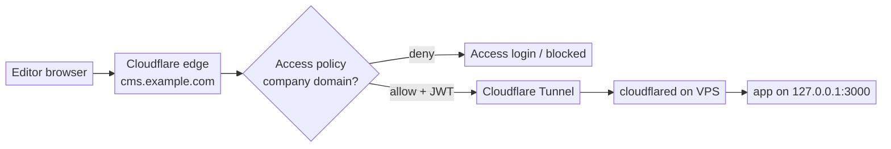

# Runbook: Protect a VPS-hosted app with Cloudflare Access + Tunnel

> **Internal runbook (generic).** Reusable pattern for putting any self-hosted
> web app behind Cloudflare Access (per-user SSO) and reaching it through a
> Cloudflare Tunnel, so the VPS exposes no public web ports. A headless CMS is
> used as the worked example. Substitute your own hostname / port / app. No real
> infrastructure identifiers appear here by design.

## 1. Goal & why

Replace an app's own (basic) authentication with **Cloudflare Access** at the
edge, and reach the app through a **Cloudflare Tunnel** so the server stops
listening on any public web port.

| Before                                                  | After                                                                |
| ------------------------------------------------------- | -------------------------------------------------------------------- |
| One shared app password (often in a config file / repo) | Per-user sign-in (SSO / one-time PIN), scoped to your company domain |
| Public `:443` on the VPS, reachable by IP               | No public web ports; origin reachable only through Cloudflare        |
| Secret lives in the app                                 | No secret in the app at all                                          |
| Direct hop to a far datacenter                          | Terminates at the nearest Cloudflare edge (faster)                   |

Watch for a subtle trap: some frameworks only apply their own auth in
"production" mode and silently skip it when run as a dev/serve process. If your
app is served that way, its built-in auth may be doing nothing — moving auth to
the edge sidesteps that entirely.

## 2. Request flow (end state)



- The only inbound port the VPS keeps open is **SSH (22)**.
- `cloudflared` connects **outbound** to Cloudflare — no inbound tunnel port to
  attack.
- Access authenticates at the edge; the tunnel also validates the Access JWT
  before traffic reaches the app.

## 3. Prerequisites

- The domain's zone is on Cloudflare.
- **Cloudflare Zero Trust** enabled (free tier covers ≤ 50 users).
- A VPS running the app, with root SSH.
- The app can bind to `127.0.0.1` (loopback only).

## 4. Step 1 — bind the app to loopback only

Once public ports are closed, only `cloudflared` (on the same box) should reach
the app, so the app must listen on loopback.

**Most important gotcha — use `127.0.0.1`, never `localhost`.** On many Linux
setups `localhost` resolves to IPv6 `[::1]` first (RFC 6724). If the app binds
to IPv4 `127.0.0.1` but the tunnel is told `localhost`, cloudflared dials
`[::1]:3000` and gets "connection refused". Pin IPv4 explicitly on both ends.

Example (Lume CMS — `_config.ts`):

```ts
server: { hostname: "127.0.0.1", port: 3000 }
```

Confirm it listens on loopback, not all interfaces:

```bash
ss -ltnp | grep :3000      # want 127.0.0.1:3000, NOT 0.0.0.0 or :::3000
curl -s -o /dev/null -w '%{http_code}\n' http://127.0.0.1:3000/   # 200
```

Remove the app's own basic auth if it is now redundant — no plaintext password
in the repo.

## 5. Step 2 — create the Access application (dashboard)

Zero Trust → **Access controls → Applications → Add an application →
Self-hosted**:

1. Name it (e.g. `cms`).
2. Public hostname = your app's host (subdomain `cms`, domain `example.com`),
   **Path blank** (whole host).
3. Policy: action **Allow**, include rule **Emails ending in**
   `@yourcompany.com`. **Not** "Everyone".
4. Login methods: one-time PIN (email) and/or Google / SSO.
5. Save.

> Access only evaluates traffic that flows **through** Cloudflare — a
> **proxied** (orange-cloud) hostname. A DNS-only (grey-cloud) record bypasses
> Access. The tunnel (next step) provides the proxied hostname.

## 6. Step 3 — create the tunnel & install the connector

Zero Trust → **Networks → Tunnels → Create a tunnel** → connector
**Cloudflared** → name it. The dashboard shows an install command with a
**connector token** (treat it like a password).

On the VPS:

```bash
# Cloudflare apt repo + key
sudo mkdir -p --mode=0755 /usr/share/keyrings
curl -fsSL https://pkg.cloudflare.com/cloudflare-public-v2.gpg \
  | sudo tee /usr/share/keyrings/cloudflare-public-v2.gpg >/dev/null
echo 'deb [signed-by=/usr/share/keyrings/cloudflare-public-v2.gpg] https://pkg.cloudflare.com/cloudflared any main' \
  | sudo tee /etc/apt/sources.list.d/cloudflared.list
sudo apt-get update && sudo apt-get install -y cloudflared

# install + start the connector as a service (token from dashboard)
sudo cloudflared service install <CONNECTOR_TOKEN>
```

Verify (expect several "Registered tunnel connection" lines):

```bash
systemctl is-active cloudflared
journalctl -u cloudflared -n 20 --no-pager | grep -i "Registered tunnel connection"
```

## 7. Step 4 — route the hostname to the local app (dashboard)

Tunnel → **Public Hostname → Add**:

- Subdomain `cms`, domain `example.com`, **Path blank**.
- Service Type **HTTP**, URL **`127.0.0.1:3000`** (not `localhost`).

Saving **auto-creates a proxied CNAME** for the hostname. Then, in that route's
advanced settings → **Access**, turn on **Enforce Access JSON Web Token (JWT)
validation** and select the application. Now cloudflared itself rejects any
request lacking a valid Access JWT — important because the app does no auth of
its own.

## 8. Step 5 — DNS cleanup

Delete any old **A / AAAA** records for the hostname that pointed at the VPS IP;
the tunnel's proxied CNAME replaces them. (If the public-hostname save
complained about an existing record, delete A/AAAA first, then re-save.)

## 9. Step 6 — lock down the origin (firewall)

```bash
sudo ufw --force delete allow 80
sudo ufw --force delete allow 443
sudo ufw status      # expect ONLY 22/tcp
```

If a reverse proxy (Caddy/nginx) existed only to serve this app, retire it — the
tunnel goes straight to `127.0.0.1:3000`:

```bash
sudo systemctl disable --now caddy
```

Final listener check — only SSH + the loopback app:

```bash
ss -ltnp | grep -E ':22 |:443|:80 |:3000'
# expect 127.0.0.1:3000 (app) and :22 (sshd); nothing on 80/443
```

## 10. Step 7 — verify (do all three)

```bash
# 1. Authenticated (signed-in / device-enrolled company user):
curl -s -o /dev/null -w '%{http_code}\n' https://cms.example.com/   # 200

# 2. Origin bypass is dead (force-connect to the VPS IP):
curl --resolve cms.example.com:443:YOUR.VPS.IP -s -o /dev/null \
  -w '%{http_code}\n' --max-time 8 https://cms.example.com/         # 000
```

3. **Deny path (manual):** open the hostname in an **incognito window, signed
   out** (and any device VPN/agent paused) → you should hit the **Cloudflare
   Access login** and be **denied** without a company identity. Enrolled devices
   auto-authenticate, so "it works for me" is not a test of the gate — always
   check the deny path from the outside.

## 11. Operations

- **Who can edit:** change the Access policy in the dashboard. No server change.
- **Deploy/update the app:** SSH in, pull, restart the service. The lockdown is
  permanent.
- **The connector token is a secret:** rotate by recreating the tunnel if
  leaked.
- **Cost:** Cloudflare Zero Trust free tier (≤ 50 users) covers this.

## 12. Rollback

1. `sudo ufw allow 80 && sudo ufw allow 443`
2. Re-enable the reverse proxy (and restore its config) if you removed it.
3. DNS: re-add the **A** record to the VPS IP; delete the tunnel CNAME.
4. `sudo systemctl disable --now cloudflared` (optional); delete the tunnel +
   public hostname in the dashboard.
5. Re-add app-level auth if you removed it.

> Reverting to a grey-cloud A record also disables Cloudflare Access (it needs a
> proxied hostname), so don't roll back DNS without restoring some other auth.

## 13. Gotchas cheat-sheet

- Use `127.0.0.1`, **not** `localhost`, in the tunnel service URL (IPv6 `::1`
  trap).
- Access needs a **proxied** hostname; the tunnel provides it.
- The connector token is a secret — rotate by recreating the tunnel.
- **Scope** the Access policy to your domain, not "Everyone".
- Turn on **tunnel JWT validation** when the app has no auth of its own.
- Your own enrolled devices auto-authenticate — always test the deny path from
  incognito.
- An app's self-auth may be a no-op behind serve-mode frameworks — verify, don't
  assume.
