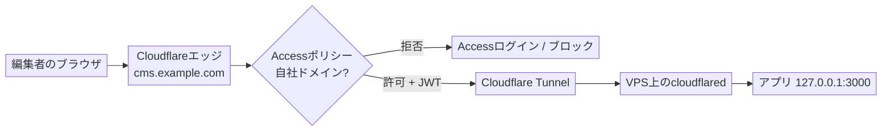

# 手順書：VPS上のアプリをCloudflare AccessとTunnelで保護する

> **社内向け手順書（汎用）。** 自前でホスティングするWebアプリをCloudflare
> Access（ユーザーごとのSSO）の背後に置き、Cloudflare
> Tunnel経由で公開して、VPSの
> Web公開ポートを一切なくすための再利用可能なパターンです。例としてヘッドレスCMSを
> 使います。ホスト名・ポート・アプリはご自身の環境に置き換えてください。実在する
> インフラ識別子は意図的に記載していません。

## 1. 目的とねらい

アプリ自身の（Basic）認証を、エッジの**Cloudflare Access**に置き換え、さらに
**Cloudflare Tunnel**経由でアプリに到達させることで、サーバーがWeb公開ポートを
リッスンしない構成にします。

<table class="not-prose w-full text-sm">
  <thead>
    <tr>
      <th>これまで</th>
      <th>これから</th>
    </tr>
  </thead>
  <tbody>
    <tr>
      <td>共有パスワード1つ（設定ファイルやリポジトリに残りがち）</td>
      <td>ユーザーごとのサインイン（SSO / ワンタイムPIN）、自社ドメインに限定</td>
    </tr>
    <tr>
      <td>VPSの公開ポート443にIPで到達できる</td>
      <td>Web公開ポートなし。オリジンにはCloudflare経由でしか到達できない</td>
    </tr>
    <tr>
      <td>秘密情報がアプリ内に存在する</td>
      <td>アプリ側に秘密情報を一切持たない</td>
    </tr>
    <tr>
      <td>遠方のデータセンターへ直接接続</td>
      <td>最寄りのCloudflareエッジで終端するため高速</td>
    </tr>
  </tbody>
</table>

見落としがちな落とし穴があります。フレームワークによっては、自前の認証を「本番モード」の
ときだけ適用し、開発用のサーブプロセスとして起動すると黙ってスキップします。アプリを
そのように起動している場合、組み込みの認証は何も働いていないかもしれません。認証を
エッジに移せば、この問題も完全に回避できます。

## 2. リクエストの流れ（最終形）



- VPSが開けたままにする受信ポートは**SSH（22）だけ**です。
- `cloudflared`はCloudflareへ**外向き**に接続するため、攻撃対象となる受信ポートがありません。
- Accessがエッジで認証し、トンネル側もAccessのJWTを検証してからアプリに届きます。

## 3. 前提条件

- ドメインのゾーンがCloudflareにあること。
- **Cloudflare Zero Trust**が有効であること（無料枠で50ユーザーまで）。
- アプリが動作するVPSと、root権限のSSHアクセス。
- アプリを`127.0.0.1`（ループバックのみ）にバインドできること。

## 4. ステップ1：アプリをループバックのみにバインドする

公開ポートを閉じたあとは、同じサーバー上の`cloudflared`だけがアプリに到達できる状態に
したいので、アプリはループバックでリッスンする必要があります。

**最も重要な落とし穴は、`localhost`ではなく`127.0.0.1`を使うことです。**
多くのLinux
環境では`localhost`がIPv6の`[::1]`に先に解決されます。アプリをIPv4の`127.0.0.1`に
バインドしているのにトンネル側で`localhost`を指定すると、`[::1]:3000`へ接続しようと
して「connection refused」になります。両側で明示的にIPv4を指定してください。

例（Lume CMSの`_config.ts`）：

```ts
server: { hostname: "127.0.0.1", port: 3000 }
```

全インターフェースではなくループバックでリッスンしていることを確認します。

```bash
ss -ltnp | grep :3000      # 127.0.0.1:3000 であること。0.0.0.0 や :::3000 ではない
curl -s -o /dev/null -w '%{http_code}\n' http://127.0.0.1:3000/   # 200
```

不要になったアプリ側のBasic認証は削除します。平文パスワードをリポジトリに置かないこと。

## 5. ステップ2：Accessアプリケーションを作成する（ダッシュボード）

Zero Trust → **Access controls → Applications → Add an application →
Self-hosted**：

1. 名前を付けます（例：`cms`）。
2. 公開ホスト名をアプリのホストに設定し（サブドメイン`cms`、ドメイン`example.com`）、**パスは空欄**（ホスト全体）。
3. ポリシー：アクション**Allow**、include条件は**Emails ending
   in**で`@yourcompany.com`。「Everyone」は使わない。
4. ログイン方法：メールのワンタイムPIN、またはGoogle / SSO。
5. 保存。

> Accessが評価するのはCloudflareを**経由する**トラフィック、つまり**プロキシ済み**
> （オレンジクラウド）のホスト名だけです。DNSのみ（グレークラウド）のレコードはAccessを
> 迂回します。次のステップのトンネルが、プロキシ済みホスト名を用意します。

## 6. ステップ3：トンネルを作成しコネクターをインストールする

Zero Trust → **Networks → Tunnels → Create a tunnel** →
コネクター**Cloudflared** →
名前を付けます。ダッシュボードに**コネクタートークン**を含むインストールコマンドが
表示されます（トークンはパスワードと同様に扱う）。

VPS上で：

```bash
# Cloudflare の apt リポジトリと鍵
sudo mkdir -p --mode=0755 /usr/share/keyrings
curl -fsSL https://pkg.cloudflare.com/cloudflare-public-v2.gpg \
  | sudo tee /usr/share/keyrings/cloudflare-public-v2.gpg >/dev/null
echo 'deb [signed-by=/usr/share/keyrings/cloudflare-public-v2.gpg] https://pkg.cloudflare.com/cloudflared any main' \
  | sudo tee /etc/apt/sources.list.d/cloudflared.list
sudo apt-get update && sudo apt-get install -y cloudflared

# コネクターをサービスとしてインストールし起動（トークンはダッシュボードから）
sudo cloudflared service install <CONNECTOR_TOKEN>
```

確認（「Registered tunnel connection」の行が複数表示されるはず）：

```bash
systemctl is-active cloudflared
journalctl -u cloudflared -n 20 --no-pager | grep -i "Registered tunnel connection"
```

## 7. ステップ4：ホスト名をローカルアプリにルーティングする（ダッシュボード）

トンネル → **Public Hostname → Add**：

- サブドメイン`cms`、ドメイン`example.com`、**パスは空欄**。
- サービスタイプ**HTTP**、URL **`127.0.0.1:3000`**（`localhost`は不可）。

保存すると、ホスト名の**プロキシ済みCNAMEが自動作成**されます。続けてそのルートの詳細
設定 → **Access**で、**Enforce Access JSON Web Token (JWT)
validation**をオンにし、
アプリケーションを選択します。これでcloudflared自身が、有効なAccessのJWTを持たない
リクエストを拒否します。アプリ自身が認証をしないため、この設定が重要です。

## 8. ステップ5：DNSを整理する

ホスト名にVPSのIPを指す古い**A / AAAA**レコードがあれば削除します。トンネルの
プロキシ済みCNAMEが置き換えになります。（公開ホスト名の保存時に既存レコードとの競合を
警告された場合は、A / AAAAを削除してから保存し直します。）

## 9. ステップ6：オリジンをロックダウンする（ファイアウォール）

```bash
sudo ufw --force delete allow 80
sudo ufw --force delete allow 443
sudo ufw status      # 22/tcp だけになっていること
```

このアプリを配信するためだけにリバースプロキシ（Caddy /
nginx）を立てていたなら、停止
できます。トンネルは`127.0.0.1:3000`へ直接つながります。

```bash
sudo systemctl disable --now caddy
```

最後の確認では、SSHとループバックのアプリだけがリッスンしている状態に：

```bash
ss -ltnp | grep -E ':22 |:443|:80 |:3000'
# 127.0.0.1:3000（アプリ）と :22（sshd）のみ。80/443 には何もない
```

## 10. ステップ7：3つの方法で検証する

```bash
# 1. 認証済み（サインイン済み・デバイス登録済みの自社ユーザー）：
curl -s -o /dev/null -w '%{http_code}\n' https://cms.example.com/   # 200

# 2. オリジンへの迂回が塞がれていること（VPSのIPへ直接接続を強制）：
curl --resolve cms.example.com:443:YOUR.VPS.IP -s -o /dev/null \
  -w '%{http_code}\n' --max-time 8 https://cms.example.com/         # 000
```

3. **拒否経路（手動）**：**サインアウトしたシークレットウィンドウ**で（端末のVPNや
   エージェントは一時停止）ホスト名を開き、**Cloudflare
   Accessのログイン**が表示され、
   自社IDがなければ**拒否される**ことを確認します。登録済み端末は自動で通過するため、
   「自分の環境では動く」はゲートの検証になりません。拒否経路は必ず外側から確認すること。

## 11. 運用

- **編集できる人**：ダッシュボードでAccessポリシーを変更するだけ。サーバー変更は不要。
- **アプリのデプロイ・更新**：SSHで入り、pullしてサービスを再起動。ロックダウンは恒久的。
- **コネクタートークンは秘密情報**：漏れたらトンネルを作り直してローテーション。
- **コスト**：Cloudflare Zero Trustの無料枠（50ユーザーまで）でまかなえる。

## 12. ロールバック

1. `sudo ufw allow 80 && sudo ufw allow 443`
2. リバースプロキシを削除していたなら再有効化（設定も復元）。
3. DNS：VPSのIPを指す**A**レコードを再追加し、トンネルのCNAMEを削除。
4. `sudo systemctl disable --now cloudflared`（任意）。ダッシュボードでトンネルと公開ホスト名を削除。
5. アプリ側の認証を削除していたなら再追加。

> グレークラウドのAレコードに戻すとCloudflare
> Accessも無効になります（プロキシ済み
> ホスト名が必要なため）。他の認証手段を用意せずにDNSをロールバックしないこと。

## 13. 落とし穴チートシート

- トンネルのサービスURLには`localhost`ではなく`127.0.0.1`を使う（IPv6
  `::1`の罠）。
- Accessが効くのは**プロキシ済み**ホスト名だけ。それはトンネルが用意する。
- コネクタートークンは秘密情報。漏れたらトンネルを作り直す。
- Accessポリシーは「Everyone」ではなく自社ドメインに**限定**する。
- アプリ自身に認証がない場合は、**トンネルのJWT検証**をオンにする。
- 自分の登録済み端末は自動で認証を通過するので、拒否経路は必ずシークレットウィンドウで確認する。
- サーブモードのフレームワークでは、アプリの自前認証が無効化されていることがある。思い込まず検証する。
