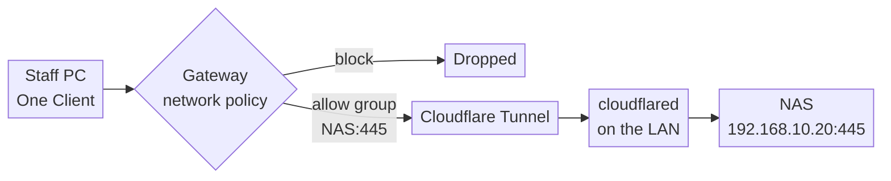

# Runbook: Remote access to an on-site NAS with WARP + Cloudflare Tunnel

> **Internal runbook (generic).** Reusable pattern for giving remote staff
> access to a file share (SMB) on an office LAN — typically a NAS that is being
> migrated to SharePoint / OneDrive — without a VPN on the office firewall and
> without opening any inbound port. Companion to
> [`cloudflare-access-tunnel-runbook-en.md`](./cloudflare-access-tunnel-runbook-en.md),
> which covers the **public hostname** case (a web app). This one covers the
> **private network** case (an IP and port on a LAN). No real infrastructure
> identifiers appear here by design; addresses are examples.

## 1. Goal & why

Replace the office firewall's remote-access VPN with the **Cloudflare One
Client** (still widely called "WARP") on staff devices, and a **Cloudflare
Tunnel** connector on the LAN that forwards only to the NAS.

| Before (firewall VPN)                                           | After (WARP + Tunnel)                                                  |
| --------------------------------------------------------------- | ---------------------------------------------------------------------- |
| VPN endpoint on the firewall, reachable from the whole internet | No inbound ports on the office firewall at all                         |
| Needs a static IPv4 and inbound IPsec/SSL-VPN                   | Connector dials **out**; works behind IPoE (MAP-E / DS-Lite) and CGNAT |
| Separate VPN accounts or a shared VPN secret                    | Microsoft Entra ID sign-in, per user, with device enrollment           |
| A connected user can usually reach the whole LAN                | Users reach **one IP and one port** (the NAS on 445) and nothing else  |
| Firewall VPN firmware is a recurring critical-CVE surface       | Nothing listening; the connector is an outbound client                 |

The IPoE row matters in Japan. Moving an office from PPPoE to IPoE usually
means IPv4-over-IPv6 (MAP-E services such as v6プラス, or DS-Lite such as
transix): the office shares an IPv4 address with a limited port set, or has no
inbound IPv4 at all. A firewall VPN that relies on a static IP stops working
unless a separate fixed-IP IPoE option is bought. This design does not care.

Use it for **access during a migration**, not as a permanent file server: SMB
is latency-sensitive and every request crosses Cloudflare.

## 2. Request flow (end state)



- The user's PC sends traffic for the NAS address into the One Client, not to
  the local network. That only happens once **Split Tunnels** are adjusted (step
  5).
- Gateway checks identity (Entra ID group), device and destination, then hands
  allowed traffic to the tunnel.
- `cloudflared` opens the TCP connection to the NAS **from its own LAN
  address**. To the NAS, every remote user looks like the connector host.
- Nothing inbound is opened on the office firewall.

## 3. Prerequisites

- A Cloudflare Zero Trust organization with **Microsoft Entra ID** as an
  identity provider, and a group for the people who should reach the NAS.
- Staff devices enrolled in the organization with the Cloudflare One Client
  (device enrollment restricted to that Entra ID group).
- An always-on host **on the office LAN** that can reach the NAS (step 1).
- The NAS's LAN IP, fixed (DHCP reservation or static).
- Cost: the Zero Trust free tier covers up to 50 users.

## 4. Step 1 — choose where `cloudflared` runs

`cloudflared` must run **inside** the office network. Options, in order of
preference for a temporary migration:

1. **On the NAS itself, as a container.** Synology (Container Manager) and QNAP
   (Container Station) can run the official `cloudflare/cloudflared` image. No
   extra hardware; goes away with the NAS.
2. **A small Linux box** — Raspberry Pi 4/5 or an entry-level mini PC with
   Ubuntu LTS. Most predictable; same install as the VPS runbook.
3. **An always-on Windows PC** (runs as a Windows service). Works, but it is
   only as available as that PC, including its update reboots.

**Not on the firewall.** FortiGate (FortiOS) and similar appliances cannot run
`cloudflared`: there is no way to install third-party software or containers.
A FortiGate _can_ build IPsec tunnels to **Cloudflare WAN** (formerly Magic
WAN), and Cloudflare documents FortiGate settings for that, but Cloudflare WAN
is an Enterprise-only product and is far more than an SMB with one NAS needs.
For site-to-site or bidirectional needs on a budget, see **Cloudflare Mesh**
(formerly WARP Connector) in section 14 — it also runs on Linux, not on the
firewall.

## 5. Step 2 — check the address plan

WARP clients sit on other people's networks. If the office LAN is
`192.168.1.0/24` and a user's home router is too, their PC cannot tell which
`192.168.1.20` is meant.

- Route **only the NAS** (`/32`), not the whole office subnet. This avoids most
  clashes and enforces least privilege at the routing layer.
- If the office uses a very common range (`192.168.0.0/24`, `192.168.1.0/24`,
  `10.0.0.0/24`) and clashes appear, the durable fix is renumbering the office
  to something uncommon (for example `10.47.0.0/24`). For a short migration, the
  `/32` route is usually enough.

The rest of this runbook uses `192.168.10.20` as the NAS.

## 6. Step 3 — create the tunnel and install the connector

Dashboard (Zero Trust): **Networks → Tunnels & Mesh → Create a tunnel** →
connector
**cloudflared** → name it (e.g. `office-nas`). Copy the install command; it
contains the **connector token** (treat it like a password).

**Option A — Linux host (Ubuntu / Raspberry Pi OS):** identical to the VPS
runbook, section 6 (`apt` repo, then `cloudflared service install <TOKEN>`).

**Option B — container on the NAS:** create a container from
`cloudflare/cloudflared:latest`, with **host networking**, restart policy
**always**, and the command:

```sh
tunnel --no-autoupdate run --token <CONNECTOR_TOKEN>
```

Equivalent `docker` command, if the NAS exposes a shell:

```sh
docker run -d --name cloudflared --restart unless-stopped --network host \
  cloudflare/cloudflared:latest tunnel --no-autoupdate run --token <CONNECTOR_TOKEN>
```

Container images do not self-update; pull a new image periodically (section
12).

**Option C — Windows:** install the `cloudflared` MSI, then in an elevated
prompt `cloudflared.exe service install <CONNECTOR_TOKEN>`.

Verify the tunnel shows **Healthy** with one replica in the dashboard.

## 7. Step 4 — route the NAS through the tunnel

Dashboard (Zero Trust): **Networks → Routes → Create route → Tunnel CIDR**:

- Tunnel: `office-nas`
- Network: `192.168.10.20/32`

Do **not** add a public hostname. SMB is not a web app; this is a private
network route only.

## 8. Step 5 — turn on the Gateway proxy

Dashboard (Zero Trust): **Traffic controls → Traffic settings → Proxy and
inspection settings** → turn on **Allow Secure Web Gateway to proxy traffic**.
Under **Select protocols to forward**:

- **TCP (required)**: always on once the proxy is on; SMB is TCP 445.
- **UDP (recommended)**: needed if you later resolve internal DNS names.
- **ICMP (recommended)**: lets `ping` and `traceroute` work for
  troubleshooting.

If the organization already filters web traffic through Gateway, this is often
on already; check rather than assume.

## 9. Step 6 — make the NAS address go through the One Client (Split Tunnels)

By default the One Client **excludes** RFC 1918 ranges (`10.0.0.0/8`,
`172.16.0.0/12`, `192.168.0.0/16`) so users can still reach their home printer.
That also means traffic to the NAS never enters the tunnel. This is the step
most setups miss.

Dashboard (Zero Trust): **Team & Resources → Device profiles** → edit the
profile staff use
→ **Split Tunnels → Manage**.

- **Exclude mode (default):** delete `192.168.0.0/16`, then **re-add** every
  part of it except the NAS address, so only `192.168.10.20` goes through
  Cloudflare. Cloudflare's docs page on connecting a CIDR has a calculator (base
  `192.168.0.0/16`, subtract `192.168.10.20/32`); paste its results back in.
- **Include mode:** add `192.168.10.20/32`.

Users may need to reconnect the client for the change to apply.

## 10. Step 7 — restrict who can reach it (Gateway network policies)

Without a policy, **every enrolled device** can reach whatever the route
exposes. Add two network policies (Zero Trust dashboard: **Traffic controls →
Firewall policies → Network** tab → **Add a policy**), in this order:

| Order | Name              | Selector(s)                                                                                                                 | Action |
| ----- | ----------------- | --------------------------------------------------------------------------------------------------------------------------- | ------ |
| 1     | `nas-allow-staff` | Destination IP **is** `192.168.10.20` **and** Destination Port **in** `445` **and** User Group Names **in** `<Entra group>` | Allow  |
| 2     | `nas-block-rest`  | Destination IP **is** `192.168.10.20`                                                                                       | Block  |

Network policies are evaluated top to bottom. Existing organization-wide
blocks (for example, security-category blocks) can stay above these two; they
match internet destinations, not a private LAN address.

Optional hardening on policy 1: add a **device posture** requirement (for
example, disk encryption or an up-to-date OS) so only managed PCs connect.

## 11. Step 8 — office firewall and NAS

**Office firewall (FortiGate or other):**

- **No inbound rules.** Nothing to port-forward.
- Allow **outbound TCP and UDP 7844** from the connector host to Cloudflare
  (`region1.v2.argotunnel.com`, `region2.v2.argotunnel.com`). UDP gives QUIC;
  if UDP is blocked, `cloudflared` falls back to TCP (HTTP/2).
- Optional: outbound **TCP 443** to `api.cloudflare.com` for update checks.
- Exempt the connector host's traffic from **SSL/deep inspection**; inspecting
  the tunnel breaks it.
- If there is an existing SSL-VPN or IPsec remote-access VPN, plan to disable it
  once staff are moved over (section 13). Fewer listening services on the
  firewall is part of the point.

**NAS:**

- Disable **SMB1**; require SMB2/3 (SMB3 preferred).
- Keep NAS user accounts per person; Cloudflare decides who reaches the NAS, the
  NAS still decides what each user can open.
- Optionally restrict SMB on the NAS's own firewall to the office subnet. Remote
  users arrive **from the connector host's address**, so they are covered.

## 12. Step 9 — verify (do all three)

```powershell
# 1. Allowed user, enrolled device, client connected (Windows):
Test-NetConnection 192.168.10.20 -Port 445        # TcpTestSucceeded : True
```

```sh
# 1. Same test on macOS:
nc -vz -w 3 192.168.10.20 445                    # succeeded
```

Then map the share: Windows File Explorer → **Network → Map network drive** →
`\\192.168.10.20\share`; macOS Finder → **Go → Connect to Server** →
`smb://192.168.10.20/share`.

2. **Deny path — wrong person:** sign in to the client as a user **outside**
   the allowed group → the port test fails.
3. **Deny path — no client:** disconnect the client on a PC that is **not** at
   the office → the NAS address does not answer. As with the web-app runbook,
   "it works for me" from an enrolled device proves nothing about the gate.

Gateway's network logs (Zero Trust dashboard: **Insights & Logs → Logs →
Network logs**) should show the allow and block decisions with user identity.

## 13. Operations

- **Who can connect:** change the Entra ID group membership, or the policy. No
  change on site.
- **Redundancy:** a single connector is a single point of failure. For more than
  a short migration, run a second replica (same token) on another LAN host.
- **Updates:** the Linux package and Windows service can auto-update; a NAS
  container does not — pull a new image monthly, or when Cloudflare announces a
  security fix.
- **Token:** the connector token is a secret. Rotate it from the tunnel page
  (**Refresh token → Rotate token**) and update every replica.
- **Performance:** fine for opening documents and copying files off; tiring for
  all-day heavy editing. That is intended — it keeps the NAS usable while its
  contents move to SharePoint / OneDrive.
- **Decommission:** when the migration is done, delete the route and the
  tunnel, remove the container or box, restore the default Split Tunnels
  exclude, and retire the firewall VPN if not done already.

## 14. When to use Cloudflare Mesh instead

`cloudflared` routes are **one-way**: users reach the LAN, and nothing on the
LAN can initiate connections back to users or to other sites. That fits file
access. If you need **two-way** private connectivity — site-to-site between two
offices, or servers that must call back to clients — look at **Cloudflare Mesh**
(formerly WARP Connector). Mesh nodes run the Cloudflare One Client headless on
**Linux**, so the "small Linux box" option applies; it still does not run on a
FortiGate.

## 15. Rollback

1. Re-enable the firewall VPN (if it was disabled) and tell users to switch
   back.
2. Delete the two Gateway network policies.
3. Restore the Split Tunnels list (re-add `192.168.0.0/16` in Exclude mode, or
   remove the `/32` in Include mode).
4. Delete the Tunnel CIDR route, then the tunnel; stop and remove the
   connector.

## 16. Gotchas cheat-sheet

- `cloudflared` must run **on the LAN**, not on the firewall. FortiGate cannot
  host it.
- **Split Tunnels** exclude private ranges by default — remove the NAS address
  from the exclude list, or nothing reaches the tunnel.
- Turn on the **Gateway TCP proxy**, or private routing does nothing.
- Route a **/32**, not the office subnet: least privilege and fewer
  home-network clashes.
- Add **network policies**; otherwise every enrolled device can reach the NAS.
- Allow **outbound 7844 TCP/UDP** and exempt the connector from SSL inspection.
- To the NAS, all remote users come **from the connector's IP**; keep per-user
  NAS accounts.
- Test the **deny path** from a non-allowed user and from a disconnected device.
- It works behind **IPoE / CGNAT** because the connector only dials out.
