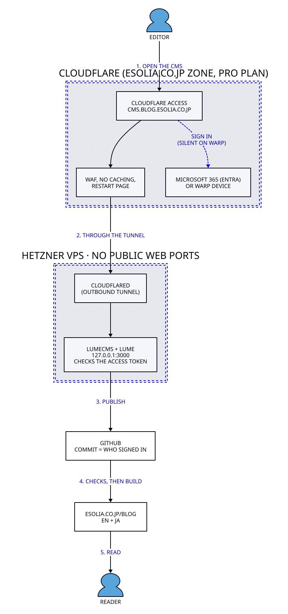
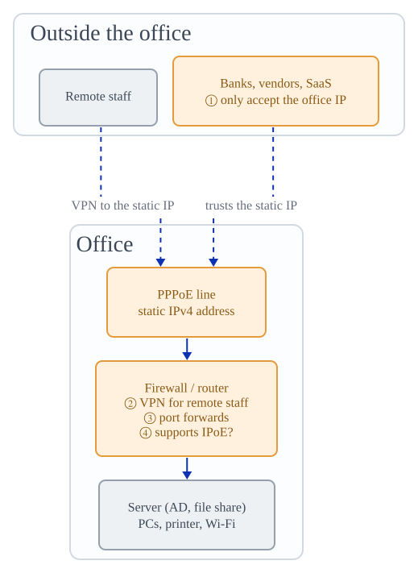
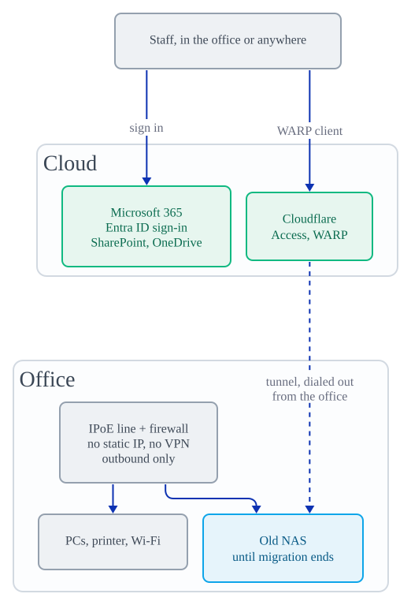

# Diagrams

D2 source plus rendered SVG and PNG. GitHub shows the rendered files; the `.d2`
is what you edit.

## CMS architecture

How an editor reaches the blog CMS, and how a published post reaches readers.



Source: [`cms-architecture.d2`](cms-architecture.d2). After editing it,
re-render both files so they stay in step ([d2](https://d2lang.com), v0.9.0
here):

```sh
d2 --pad=24 docs/diagrams/cms-architecture.d2 docs/diagrams/cms-architecture.svg
d2 --pad=24 docs/diagrams/cms-architecture.d2 docs/diagrams/cms-architecture.png
```

The PNG is for places that cannot show an SVG, such as the staff guide and chat.

Details behind the diagram:
[Cloudflare Access + Tunnel runbook](../cloudflare-access-tunnel-runbook-en.md)
([日本語](../cloudflare-access-tunnel-runbook-ja.md)) and the CMS sections of
the [README](../../README.md).

## Office network before / after an IPoE switch

Figures for the small-office network post
(`src/posts/20260706-small-office-network-infrastructure-en.md` and its JA
twin). Orange marks what depends on the old line, green is where those
dependencies move, blue is temporary.




Sources: `202603f-office-network-{before,after}.d2`, with Japanese labels in
the matching `.ja.d2` files. These carry no style block; the eSolia preamble is
added at render time by the codex renderer, which writes the SVG and PNG beside
the source:

```sh
cd ~/dev/codex
npx tsx scripts/sync-d2.ts --file ~/dev/blog.esolia.pro/docs/diagrams/202603f-office-network-before.d2
```

Then copy each PNG into `src/uploads/` as
`202603f-office-network-{before,after}-{en,ja}.png`.
