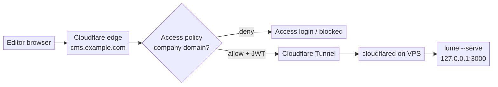

# Hosting Lume CMS behind Cloudflare Access + Tunnel (a Cloudflare-native alternative)

A community write-up of an alternative way to expose
[Lume CMS](https://lume.land/cms/) on a VPS, for teams already using Cloudflare.

The official guide
([Lume CMS → Deployment → VPS](https://lume.land/cms/deployment/vps/),
[`lumeland/cms-deploy`](https://github.com/lumeland/cms-deploy)) sets up **Caddy
as a public HTTPS reverse proxy** (ports 80/443), a **DNS A record → your server
IP**, the CMS as a **systemd service**, and **username/password basic auth** in
an `.env` file. That works great and is the right default.

This variant keeps the Deno + systemd + git base, but **replaces the
public-facing layer**: instead of Caddy on public ports with a shared password,
the CMS sits behind a **Cloudflare Tunnel** (no public web ports at all) and is
authenticated by **Cloudflare Access** (per-user SSO / one-time PIN). As a
bonus, it's noticeably faster for geographically distant editors, because
requests terminate at the nearest Cloudflare edge instead of hopping to your VPS
region.

> Not a replacement for the official guide — just an option if you're on
> Cloudflare and want SSO + a closed origin. Generic throughout; substitute your
> own hostname/port.

## Why you might want this

| Official `cms-deploy`                                    | This Cloudflare variant                                                            |
| -------------------------------------------------------- | ---------------------------------------------------------------------------------- |
| Caddy serves public `:80`/`:443`; origin reachable by IP | **No public web ports**; origin reachable only via the tunnel                      |
| Shared username/password in `.env`                       | **Per-user** sign-in (SSO / OTP), scoped to your company domain; no app credential |
| TLS via Caddy/Let's Encrypt on the box                   | TLS terminated at the Cloudflare edge                                              |
| Direct hop to your VPS region                            | Terminates at the **nearest Cloudflare edge** → faster for distant users           |
| Origin IP is exposed (and scannable)                     | Origin IP never published; direct hits are firewalled off                          |

Trade-offs: you take on a dependency on Cloudflare (a zone on Cloudflare + Zero
Trust enabled — the free tier covers up to 50 users), and there's a little more
dashboard setup. If you don't use Cloudflare, the official Caddy setup is
simpler.

## Architecture



The only inbound port the VPS keeps open to the internet is **SSH**.
`cloudflared` dials **out** to Cloudflare, so there's no inbound tunnel port to
attack. Access authenticates at the edge, and (optionally) the tunnel
re-validates the Access JWT before traffic reaches the CMS.

## What changes vs. the official setup

You can still use `cms-deploy`'s `install.sh` to get Deno, the CMS systemd
service, and the git workflow. Then, instead of the Caddy + public-DNS layer:

1. Bind the CMS to **loopback only**.
2. Create a **Cloudflare Access** application for the hostname.
3. Install the **`cloudflared`** connector and route the hostname through a
   tunnel.
4. **Delete the public A/AAAA record** (the tunnel creates a proxied CNAME).
5. **Close public ports** 80/443 in the firewall; you can disable Caddy.

### 1. Bind the CMS to loopback

In `_config.ts`:

```ts
const site = lume({
  location: new URL("https://blog.example.com"),
  server: { hostname: "127.0.0.1", port: 3000 }, // IPv4 loopback, explicit
}, { markdown });
```

**Gotcha that bites everyone:** use `127.0.0.1`, not `localhost`. On Ubuntu,
`localhost` resolves to IPv6 `[::1]` first; if the CMS binds to IPv4 `127.0.0.1`
but the tunnel is pointed at `localhost`, `cloudflared` dials `[::1]:3000` and
gets connection-refused. Pin IPv4 on both ends.

Confirm:

```bash
ss -ltnp | grep :3000      # want 127.0.0.1:3000, NOT 0.0.0.0 / :::3000
curl -s -o /dev/null -w '%{http_code}\n' http://127.0.0.1:3000/admin   # 200
```

> Auth note: on recent Lume the CMS runs via `lume --serve`, and the plugin only
> applies `cms.auth()` when the site `location.hostname` isn't localhost.
> Depending on how you run it, the built-in basic auth may not engage in serve
> mode — moving auth to the Cloudflare edge side-steps that question entirely.
> (You can still keep `cms.auth()` if you like; Access simply sits in front.)

### 2. Create the Access application

Cloudflare **Zero Trust → Access → Applications → Add → Self-hosted**:

- Hostname: e.g. subdomain `cms`, domain `example.com`, **path blank** (whole
  host).
- Policy: **Allow**, include rule **Emails ending in** `@yourcompany.com` (not
  "Everyone").
- Login methods: one-time PIN (email) and/or Google / your IdP.

Access only evaluates traffic that flows **through** Cloudflare — i.e. a
**proxied** hostname. The tunnel below provides that.

### 3. Install cloudflared + create the tunnel

Zero Trust → **Networks → Tunnels → Create a tunnel → Cloudflared**, name it,
copy the install command (it contains a connector token — treat it as a secret).
On the VPS:

```bash
sudo mkdir -p --mode=0755 /usr/share/keyrings
curl -fsSL https://pkg.cloudflare.com/cloudflare-public-v2.gpg \
  | sudo tee /usr/share/keyrings/cloudflare-public-v2.gpg >/dev/null
echo 'deb [signed-by=/usr/share/keyrings/cloudflare-public-v2.gpg] https://pkg.cloudflare.com/cloudflared any main' \
  | sudo tee /etc/apt/sources.list.d/cloudflared.list
sudo apt-get update && sudo apt-get install -y cloudflared
sudo cloudflared service install <CONNECTOR_TOKEN>
```

Verify several connections registered:

```bash
journalctl -u cloudflared -n 20 --no-pager | grep -i "Registered tunnel connection"
```

### 4. Route the hostname (and turn on JWT validation)

In the tunnel's **Public Hostname → Add**:

- Subdomain `cms`, domain `example.com`, **path blank**.
- Service **HTTP** → **`127.0.0.1:3000`** (again, not `localhost`).

Saving auto-creates the **proxied CNAME**. Then in that route's advanced
settings → **Access**, enable **Enforce Access JWT validation** and select your
app, so `cloudflared` itself rejects any request without a valid Access token
(good defense-in-depth when the app has no auth of its own).

### 5. Clean up DNS + lock down the origin

Delete the old `cms.example.com` **A/AAAA** records pointing at the VPS IP (the
tunnel's CNAME replaces them). Then close public web ports and drop Caddy:

```bash
sudo ufw --force delete allow 80
sudo ufw --force delete allow 443
sudo ufw status                       # expect only 22/tcp
sudo systemctl disable --now caddy    # tunnel goes straight to :3000
```

Final listener check — only SSH + the loopback CMS:

```bash
ss -ltnp | grep -E ':22 |:443|:80 |:3000'
```

## Verify (all three)

```bash
# Authenticated (signed-in / device-enrolled company user):
curl -s -o /dev/null -w '%{http_code}\n' https://cms.example.com/admin   # 200

# Origin bypass is dead (force-connect to the VPS IP):
curl --resolve cms.example.com:443:YOUR.VPS.IP -s -o /dev/null \
  -w '%{http_code}\n' --max-time 8 https://cms.example.com/admin         # 000
```

And by hand: open the hostname in an **incognito window, signed out** (pause any
device VPN/agent) → you should hit the Cloudflare Access login and be denied
without a company identity. Enrolled devices auto-authenticate, so "it works for
me" isn't a test of the gate — always check the deny path from the outside.

## Day-to-day

- **Deploy/update:** unchanged —
  `git pull && sudo systemctl restart <cms-service>` on the VPS.
- **Manage who can edit:** change the Access policy in the dashboard; no server
  change.
- **Cost:** Cloudflare Zero Trust free tier (≤ 50 users).

## Gotchas cheat-sheet

- `127.0.0.1`, **not** `localhost`, in the tunnel service URL (the IPv6 `::1`
  trap).
- Access needs a **proxied** hostname — the tunnel provides it; a
  grey-cloud/DNS-only record bypasses Access.
- **Scope** the Access policy to your domain, not "Everyone".
- Turn on **tunnel JWT validation** if the CMS has no auth of its own.
- Your own enrolled devices auto-authenticate — test the deny path from
  incognito.

## Credits

Builds directly on the official Lume CMS VPS guide and
[`lumeland/cms-deploy`](https://github.com/lumeland/cms-deploy) — this just
swaps the public-facing layer for a Cloudflare-native one. Thanks to the Lume
team for the CMS and the deployment tooling. Shared in case it's useful to other
Cloudflare users.
