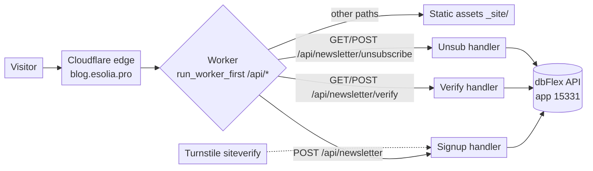
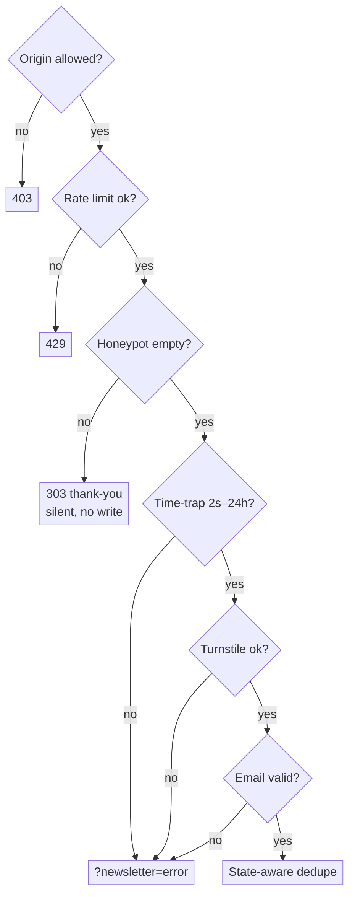
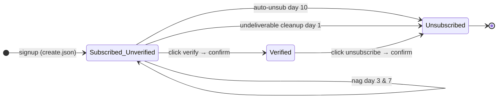

# Newsletter Subscription System — Architecture & Runbook

> **Internal reference.** How the "Stay Informed" newsletter signup on
> blog.esolia.pro works end to end: the Cloudflare Worker that gates signup and
> hosts verify/unsubscribe, and the dbFlex (PROdb, app 15331)
> `Email Newsletter
> Subscriber` table that stores subscribers and drives the
> confirmation / nag / auto-unsubscribe lifecycle. Last updated 2026-07-23.

## 1. Why this exists

The signup form used to POST directly to a **public** dbFlex web-to-record
gateway, with no bot check. That produced a steady stream of junk records, and
because the endpoint URL sat in public HTML, spammers could POST to it directly.

The system now routes every write through the site's Cloudflare Worker, which
verifies the request before writing to dbFlex over the **authenticated**
TeamDesk API. Double opt-in (email confirmation) and unsubscribe also run
through the Worker instead of the old public web-to-record pages.

| Concern              | Before                             | After                                         |
| -------------------- | ---------------------------------- | --------------------------------------------- |
| Bot / spam signups   | none                               | Turnstile + honeypot + time-trap + rate limit |
| dbFlex write path    | public web-to-record URL in HTML   | authenticated API, server-side only           |
| Email ownership      | not confirmed                      | double opt-in via confirmation email          |
| Verify / unsubscribe | public `subops.html` (GET mutates) | Worker, POST-confirm (scanner-safe)           |
| Dead addresses       | delivered / nagged anyway          | Bouncer gating, silently reaped               |

## 2. Architecture

- **Worker:** `worker/index.ts`. Same Worker also serves the whole static site
  (`env.ASSETS`) and runs the nightly rebuild cron — the newsletter handlers are
  additive.
- **`run_worker_first: ["/api/*"]`** in `wrangler.jsonc` is required: without
  it, a form POST carrying `Sec-Fetch-Mode: navigate` is served the 404 asset
  instead of invoking the Worker.
- **Signup form:** `src/_includes/templates/panel-cta.vto`, rendered on the ja
  (`/`) and en (`/en/`) home pages.

## 3. Signup flow

`POST /api/newsletter` → `handleNewsletter()`. Checks run cheapest-first; any
failure short-circuits:

Gates, in order:

1. **Origin allowlist** — `Origin` must be `https://blog.esolia.pro`, else
   `403`.
2. **Rate limit** — `NEWSLETTER_LIMIT` binding, 5 requests / 60s per IP, else
   `429`.
3. **Honeypot** — hidden `website` field; if filled, redirect to the thank-you
   page _as if successful_ (no signal to the bot) and write nothing.
4. **Time-trap** — hidden `ts` stamped client-side on page load; reject if the
   submit is faster than 2s or older than 24h.
5. **Turnstile** — validate the `cf-turnstile-response` token against
   `siteverify`. Managed widget, `interaction-only` (invisible to real
   visitors). Sitekey `0x4AAAAAABhkr_JNco-SeAbS` (public) is in `src/_data.yml`.
6. **Email validation** — trim, length ≤ 254, strict regex, reject a small set
   of disposable domains.
7. **State-aware dedupe** — see §4.
8. **Create** — `create.json` (workflow=1) with `{Email, Reference}`;
   `Reference` is set server-side from a fixed per-locale table, then `303` to
   the thank-you page.

All redirect targets and the stored `Reference` are constructed server-side from
a fixed allowlist, never read from the request (closes the open-redirect the old
`retURL` hidden field allowed).

## 4. State-aware dedupe

The `Email` column is **intentionally not unique** (see §8), so a pre-insert
lookup — not a DB constraint — is the dedup. The handler queries the address
(reads a few rows so leftover duplicates still resolve) and branches:

| Existing record state                          | Outcome                        | Visitor sees                                                      |
| ---------------------------------------------- | ------------------------------ | ----------------------------------------------------------------- |
| `Subscribed?` **and** `Verified?`              | already a confirmed subscriber | "already subscribed" (`?newsletter=exists`)                       |
| `Subscribed?`, not `Verified?`                 | registered, not yet confirmed  | amber "please confirm — check your inbox" (`?newsletter=pending`) |
| only unsubscribed / auto-unsubscribed, or none | re-subscribe                   | fresh `create.json`, clean verify + nag cycle                     |

The three messages are revealed on the form by a small inline script mapping
`?newsletter=error|exists|pending` → `#newsletter-{state}`.

## 5. Verify & unsubscribe

Both live on the Worker and replace the public `subops.html`. The subscriber
email links carry only the record's primary key (`§ Id`, a 32-hex GUID):

- `GET /api/newsletter/verify|unsubscribe?guid=<§ Id>` → renders a bilingual
  confirm page. **Read-only — it never mutates.** This is deliberate: email
  security scanners and link-prefetchers (Outlook Safe Links, Mimecast,
  Slack/Teams unfurls, AV) issue GETs, and must not be able to auto-verify or
  auto-unsubscribe.
- `POST` (from the confirm button) → looks the record up by `§ Id` and updates
  it via `update.json`: verify sets `Subscribed?`+`Verified?` true; unsubscribe
  sets `Subscribed?` false. The Worker sets state from the **route**, trusting
  nothing else from the URL (the old `Operation`/`Subscribed`/`Email` params are
  ignored).

Locale for the pages is inferred from the record's `Reference` (`/en` →
English). Malformed GUIDs are rejected before any API call. Pages show the
eSolia logo and a locale-aware "back to the blog" link.

## 6. Subscriber lifecycle

Signup, confirmation, reminders, and cleanup are a mix of the Worker (signup +
the verify/unsubscribe endpoints) and dbFlex time-based triggers.

dbFlex daily triggers on `Email Newsletter Subscriber`:

| Trigger                              | ~Time | Condition (formula field)                                 | Action                                 |
| ------------------------------------ | ----- | --------------------------------------------------------- | -------------------------------------- |
| Auto-Void Daily when bot             | 08:00 | clear bot (dupe email, sub-minute create, en+ja)          | void record                            |
| Auto-Cleanup BC Status Undeliverable | 08:15 | `BC Undeliverable Cleanup?` (undeliverable/risky, ≥1 day) | set `Subscribed?`=false, **no email**  |
| Auto-Unsubscribe Daily               | 08:45 | `Auto Unsubscribe Needed?` (nagged, unverified, ≥10 days) | set `Subscribed?`=false + notice email |
| Nag Daily                            | 09:00 | `Nag Needed?` (subscribed, unverified, ≥3 / ≥7 days)      | re-send confirmation + set `Nagged?`   |

Bouncer (email deliverability) runs after insert via the "Verify if not Bot"
trigger and writes `BC Status` (`deliverable` / `undeliverable` / `risky` /
`unknown`). The nag / cleanup formulas gate on it so dead addresses are reaped
at day 1 and never nagged.

**Net timeline for an unverified deliverable signup:** confirmation on signup →
nag at day 3 and day 7 (working Worker links) → auto-unsubscribe at day 10.
Undeliverable/risky addresses are silently dropped at day 1 instead.

## 7. Configuration reference

### Cloudflare Worker (`wrangler.jsonc`)

- `assets.run_worker_first: ["/api/*"]`
- `ratelimits`: `NEWSLETTER_LIMIT`, `simple { limit: 5, period: 60 }` (top-level
  key — **not** `unsafe.bindings`, which current wrangler rejects)
- Secrets (set via `wrangler secret put`): `TURNSTILE_SECRET_KEY`,
  `DBFLEX_API_KEY_01` (shared with the esolia-2025 contact-form Worker, app
  15331), `GITHUB_TOKEN` (rebuild cron).

### dbFlex table `Email Newsletter Subscriber` (app 15331)

Key column is `§ Id` (AutoNumber, `{GUID}` 32-hex format — switched from a
sequential `ENS-…` format because sequential verify links were guessable).

| Field                            | API id       | Notes                                                |
| -------------------------------- | ------------ | ---------------------------------------------------- |
| `§ Id`                           | `f_64244793` | primary key / GUID token in emails                   |
| `Email`                          | `f_64244897` | not unique by design (§8)                            |
| `Reference`                      | `f_64244810` | signup URL; drives locale (`/en` → en)               |
| `Subscribed?`                    | `f_64258005` | active subscription                                  |
| `Verified?`                      | `f_64360375` | double opt-in confirmed                              |
| `Verified TS`                    | `f_64501744` |                                                      |
| `Unsubscribed TS`                | `f_64501745` |                                                      |
| `Verify URL` / `Unsubscribe URL` | formula-URL  | now point at the Worker, keeping `URLEncode([§ Id])` |
| `BC Status` / `BC Reason`        | Bouncer      | deliverability assessment                            |

The API addresses tables by name; filters use column display names in brackets
(e.g. `[§ Id]="…"`). Delete/void require the "full" token role, which the API
token lacks — clean test records up in the UI.

## 8. Design decisions

- **Email stays non-unique.** A legitimate re-subscribe adds a fresh row, which
  doubles as an audit log of renewed consent. That rules out a DB unique
  constraint, so the Worker's form-submit state check _is_ the dedup. The only
  case a unique constraint would have caught that this doesn't: two simultaneous
  first-time signups of the same brand-new address — negligible for a
  newsletter.
- **create.json, not upsert.** TeamDesk upsert-on-match requires a unique column
  (rejects with code 3106 otherwise), so with a non-unique email, create +
  lookup is the permanent design.
- **POST-only mutation** on verify/unsubscribe is the core hardening over the
  old GET-based `subops.html`.

## 9. Operations & maintenance

- **Format with a stable deno.** The CF build runs `deno task build:cloudflare`
  (`deno lint && deno fmt --check && deno task lume`) under **deno 2.7.14**. The
  dev machine's default is a 2.9.1 canary that formats `.vto` and inline
  `<script>` differently and fails the check. Format with a stable deno before
  pushing (e.g. `~/.dvm/versions/2.8.2/deno fmt <files>`), never the canary.
- **Worker preflight:** `deno check worker/index.ts`, `deno lint`,
  `wrangler deploy --dry-run` (validates config + bundles).
- **Local endpoint testing:** `wrangler dev` with a `.dev.vars` holding
  `DBFLEX_API_KEY_01` (+ a Turnstile test key). GET verify/unsubscribe pages are
  read-only and safe to hit against real records.
- **Deploy:** merge to `main` → Cloudflare Workers Builds builds and deploys.
  Worker version rollout across edge PoPs takes a minute or two after "success".

## 10. Open items & references

- **Retire the public signup gateway** (table 1510483) on the dbFlex side — the
  step that actually closes the original spam vector. Until it is disabled or
  its token rotated, previously-harvested gateway URLs still bypass the
  Turnstile gate. (There is no self-serve "disable"; pending dbFlex support.)
- **`Nag Needed?` guard bug:**
  `[BC Status] <> "undeliverable" or [BC Status] <>
  "risky"` is a tautology
  (always true) — it should be `and`. Currently masked because the day-1 cleanup
  unsubscribes those records before the day-3 nag, but worth correcting so the
  guard is real.

PRs (all merged): #282 signup gate, #288 create + dedupe, #290
verify/unsubscribe, #291 400-hardening, #292 logo + back-link, #293 state-aware
dedupe. Related issues: #283 (retire gateway), #285 / #286 (pre-existing
pagefind / TOC).
