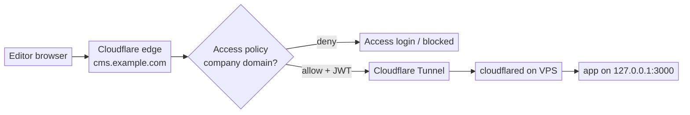

If you run a small admin app on a VPS and protect it with a single shared password, you can do a lot better: this guide replaces app-level basic auth with **Cloudflare Access** for proper per-user sign-in, and puts the app behind a **Cloudflare Tunnel** so the server stops listening on any public web port at all. We use a self-hosted CMS editor as the worked example, but the pattern fits any internal web app.

<!--more-->

## Why bother

A shared password baked into an app has three problems: everyone uses the same one, it tends to end up in a config file (or a git repo), and the server is still sitting on a public port waiting to be scanned. Moving authentication to the edge fixes all three.

| Before | After |
| --- | --- |
| One shared app password | Per-user sign-in (SSO / one-time PIN), scoped to your company domain |
| Public `:443` on the VPS, reachable by IP | No public web ports; origin reachable only through Cloudflare |
| Password lives in the app/repo | No secret in the app at all |
| Direct hop to a far-away datacenter | Terminates at the nearest Cloudflare edge, so it is faster too |

There is also a subtle trap worth calling out: some frameworks only apply their own auth in "production" mode and silently skip it when run as a dev/serve process. If your app is served that way, its built-in auth may be doing nothing. Moving auth to the edge sidesteps that entirely.

## The shape of it



The only inbound port the VPS keeps open to the internet is **SSH**. `cloudflared` makes an **outbound** connection to Cloudflare, so there is no inbound tunnel port to attack. Access authenticates at the edge, and the tunnel also validates the Access token before any traffic reaches your app.

## What you need

- Your domain's zone on Cloudflare.
- **Cloudflare Zero Trust** enabled (the free tier covers up to 50 users).
- A VPS running the app, with SSH access.
- The app able to bind to `127.0.0.1` (loopback only).

## Step 1: bind the app to loopback only

Once we close the public ports, only `cloudflared` (running on the same box) should be able to reach the app, so the app must listen on the loopback interface.

**The single most important gotcha:** use `127.0.0.1`, never `localhost`. On many Linux setups `localhost` resolves to IPv6 `[::1]` first. If your app binds to IPv4 `127.0.0.1` but you point the tunnel at `localhost`, the tunnel dials `[::1]:3000` and gets "connection refused". Pin IPv4 explicitly on both sides.

For our CMS the server config was:

```ts
server: { hostname: "127.0.0.1", port: 3000 }
```

Confirm it is listening on loopback, not on all interfaces:

```bash
ss -ltnp | grep :3000      # want 127.0.0.1:3000, NOT 0.0.0.0 or :::3000
curl -s -o /dev/null -w '%{http_code}\n' http://127.0.0.1:3000/   # 200
```

While you are here, remove the app's own basic auth if it is now redundant. A plaintext password should not live in your repo, and the edge is doing the work now.

## Step 2: create the Access application

In the **Zero Trust dashboard**, go to **Access controls → Applications → Add an application → Self-hosted**:

1. Name it (e.g. `cms`).
2. Set the public hostname to your app's hostname (e.g. subdomain `cms`, domain `example.com`), and leave **Path blank** to protect the whole host.
3. Add a policy: action **Allow**, with an include rule of **Emails ending in** `@yourcompany.com`. Do not use "Everyone" here, or anyone who can complete a login gets in.
4. Choose login methods (one-time PIN by email, or Google / your SSO).
5. Save.

One thing to understand: Access only evaluates traffic that actually flows **through** Cloudflare, meaning a **proxied** (orange-cloud) hostname. A DNS-only (grey-cloud) record points straight at your server and bypasses Access completely. The tunnel in the next step gives you a proxied hostname automatically.

## Step 3: create the tunnel and install the connector

In **Zero Trust → Networks → Tunnels → Create a tunnel**, choose the **Cloudflared** connector and name it. The dashboard then shows an install command containing a **connector token**. Treat that token like a password.

On the VPS, add Cloudflare's package repo and install the connector:

```bash
sudo mkdir -p --mode=0755 /usr/share/keyrings
curl -fsSL https://pkg.cloudflare.com/cloudflare-public-v2.gpg \
  | sudo tee /usr/share/keyrings/cloudflare-public-v2.gpg >/dev/null
echo 'deb [signed-by=/usr/share/keyrings/cloudflare-public-v2.gpg] https://pkg.cloudflare.com/cloudflared any main' \
  | sudo tee /etc/apt/sources.list.d/cloudflared.list
sudo apt-get update && sudo apt-get install -y cloudflared

# install + start the connector as a service (token from the dashboard)
sudo cloudflared service install <CONNECTOR_TOKEN>
```

Confirm it connected (you should see several "Registered tunnel connection" lines):

```bash
systemctl is-active cloudflared
journalctl -u cloudflared -n 20 --no-pager | grep -i "Registered tunnel connection"
```

## Step 4: route the hostname to the local app

Back in the tunnel's configuration, add a **public hostname**:

- Subdomain `cms`, domain `example.com`, **path blank**.
- Service type **HTTP**, URL **`127.0.0.1:3000`** (again: not `localhost`).

Saving this **auto-creates a proxied CNAME** for your hostname. That is what makes Access take effect.

Then, while you are in that route's advanced settings, expand **Access** and turn on **Enforce Access JSON Web Token (JWT) validation**, selecting the application you created. Now the tunnel itself rejects any request that does not carry a valid Access token, so even a misconfigured edge binding cannot expose the app. This matters because the app does no authentication of its own anymore.

## Step 5: clean up DNS

If the hostname previously had **A / AAAA** records pointing at your VPS IP, delete them. The tunnel's proxied CNAME replaces them. (If creating the public hostname complained about an existing record, that conflict is why; delete the A/AAAA, then re-save.)

## Step 6: lock down the origin

Now close the public web ports on the VPS, keeping only SSH:

```bash
sudo ufw --force delete allow 80
sudo ufw --force delete allow 443
sudo ufw status      # expect ONLY 22/tcp
```

If you had a reverse proxy (such as Caddy or nginx) only to serve this app, you can retire it now; the tunnel goes straight to `127.0.0.1:3000`:

```bash
sudo systemctl disable --now caddy
```

A final check should show only SSH and your loopback app listening:

```bash
ss -ltnp | grep -E ':22 |:443|:80 |:3000'
# expect 127.0.0.1:3000 (app) and :22 (sshd); nothing on 80/443
```

## Step 7: verify, all three ways

```bash
# Authenticated (from a signed-in / device-enrolled company user):
curl -s -o /dev/null -w '%{http_code}\n' https://cms.example.com/   # 200

# Origin bypass is dead (force a connection straight to the VPS IP):
curl --resolve cms.example.com:443:YOUR.VPS.IP -s -o /dev/null \
  -w '%{http_code}\n' --max-time 8 https://cms.example.com/         # 000
```

And the one you must do by hand: open the hostname in an **incognito window, signed out** (and with any device VPN/agent paused), and confirm you hit the **Cloudflare Access login** and are **denied** without a company identity. If your own machine is enrolled in your Zero Trust org, it will sail through automatically, so "it works for me" is not a test of the gate. Always check the deny path from the outside.

## Living with it

- **Add or remove who can edit:** change the Access policy in the dashboard. No server change.
- **Deploy or update the app:** SSH in, pull, restart the service. The lockdown is permanent, so no firewall or DNS steps again.
- **The connector token is a secret:** rotate it by recreating the tunnel if it ever leaks.
- **Cost:** the Cloudflare Zero Trust free tier (up to 50 users) covers this comfortably.

## The short list of traps

- Use `127.0.0.1`, not `localhost`, in the tunnel's service URL.
- Access only works on a **proxied** hostname; the tunnel provides that.
- Scope the Access policy to your domain, not "Everyone".
- Turn on tunnel JWT validation when the app has no auth of its own.
- Your own enrolled devices auto-authenticate, so always test the deny path from incognito.

That is the whole pattern: strong per-user auth at the edge, zero public web ports on the origin, and a faster path for your users. Once it clicks, you will want every internal app behind it.
