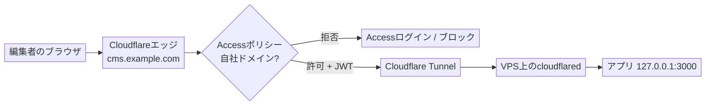

VPS上で動かしている管理用アプリを共有パスワード1つで守っているなら、もっと良い方法があります。この記事では、アプリ側のBasic認証を**Cloudflare Access**によるユーザーごとのサインインに置き換え、さらに**Cloudflare Tunnel**の背後にアプリを置くことで、サーバーがWeb公開ポートを一切リッスンしない構成にする手順を解説します。例として自前ホスティングのCMSエディターを使いますが、このパターンはあらゆる社内向けWebアプリに応用できます。

<!--more-->

## なぜやるのか

アプリに共有パスワードを1つ埋め込む方式には、3つの問題があります。全員が同じパスワードを使うこと、設定ファイル（やgitリポジトリ）に残りがちなこと、そしてサーバーが公開ポートでスキャンされ続けることです。認証をエッジに移すと、この3つすべてが解決します。

<table class="not-prose w-full text-sm">
  <thead>
    <tr>
      <th>これまで</th>
      <th>これから</th>
    </tr>
  </thead>
  <tbody>
    <tr>
      <td>共有パスワード1つ</td>
      <td>ユーザーごとのサインイン（SSO / ワンタイムPIN）、自社ドメインに限定</td>
    </tr>
    <tr>
      <td>VPSの公開ポート443にIPで到達できる</td>
      <td>Web公開ポートなし。オリジンにはCloudflare経由でしか到達できない</td>
    </tr>
    <tr>
      <td>パスワードがアプリやリポジトリに存在する</td>
      <td>アプリ側に秘密情報を一切持たない</td>
    </tr>
    <tr>
      <td>遠方のデータセンターへ直接接続</td>
      <td>最寄りのCloudflareエッジで終端するため高速</td>
    </tr>
  </tbody>
</table>

もう1つ、見落としがちな落とし穴があります。フレームワークによっては、自前の認証を「本番モード」のときだけ適用し、開発用のサーブプロセスとして起動すると黙ってスキップする場合があります。アプリをそのように起動している場合、組み込みの認証は何も働いていないかもしれません。認証をエッジに移せば、この問題も完全に回避できます。

## 全体像



VPSがインターネットに開けたままにする受信ポートは**SSHだけ**です。`cloudflared`はCloudflareへ**外向き**に接続するため、攻撃対象となる受信用のトンネルポートは存在しません。Accessがエッジで認証し、トンネル側もAccessトークンを検証してから、トラフィックがアプリに届きます。

## 必要なもの

- ドメインのゾーンがCloudflareにあること。
- **Cloudflare Zero Trust**が有効であること（無料枠で50ユーザーまで対応）。
- アプリが動作しているVPSと、SSHアクセス。
- アプリを`127.0.0.1`（ループバックのみ）にバインドできること。

## ステップ1：アプリをループバックのみにバインドする

公開ポートを閉じたあとは、同じサーバー上で動く`cloudflared`だけがアプリに到達できる状態にしたいので、アプリはループバックインターフェースでリッスンする必要があります。

**最も重要な落とし穴は、`localhost`ではなく`127.0.0.1`を使うことです。** 多くのLinux環境では`localhost`がIPv6の`[::1]`に先に解決されます。アプリをIPv4の`127.0.0.1`にバインドしているのにトンネル側で`localhost`を指定すると、トンネルは`[::1]:3000`へ接続しようとして「connection refused」になります。両側で明示的にIPv4を指定してください。

今回のCMSではサーバー設定は次のとおりでした。

```ts
server: { hostname: "127.0.0.1", port: 3000 }
```

全インターフェースではなくループバックでリッスンしていることを確認します。

```bash
ss -ltnp | grep :3000      # 127.0.0.1:3000 であること。0.0.0.0 や :::3000 ではない
curl -s -o /dev/null -w '%{http_code}\n' http://127.0.0.1:3000/   # 200
```

このタイミングで、不要になったアプリ側のBasic認証は削除しておきましょう。平文のパスワードをリポジトリに置くべきではありませんし、認証はエッジが担うようになります。

## ステップ2：Accessアプリケーションを作成する

**Zero Trustダッシュボード**で、**Access controls → Applications → Add an application → Self-hosted**へ進みます。

1. 名前を付けます（例：`cms`）。
2. 公開ホスト名をアプリのホスト名に設定し（例：サブドメイン`cms`、ドメイン`example.com`）、ホスト全体を保護するために**パスは空欄**のままにします。
3. ポリシーを追加します。アクションは**Allow**、include条件は**Emails ending in**で`@yourcompany.com`を指定します。ここで「Everyone」を使ってはいけません。ログインを完了できる人なら誰でも入れてしまいます。
4. ログイン方法を選びます（メールのワンタイムPIN、またはGoogleや自社のSSO）。
5. 保存します。

ここで理解しておきたい点があります。Accessが評価するのは、実際にCloudflareを**経由する**トラフィック、つまり**プロキシ済み（オレンジクラウド）**のホスト名だけです。DNSのみ（グレークラウド）のレコードはサーバーへ直接向くため、Accessを完全に迂回してしまいます。次のステップのトンネルが、このプロキシ済みホスト名を自動的に用意してくれます。

## ステップ3：トンネルを作成しコネクターをインストールする

**Zero Trust → Networks → Tunnels → Create a tunnel**で、**Cloudflared**コネクターを選んで名前を付けます。するとダッシュボードに、**コネクタートークン**を含むインストールコマンドが表示されます。このトークンはパスワードと同じように扱ってください。

VPS上で、Cloudflareのパッケージリポジトリを追加してコネクターをインストールします。

```bash
sudo mkdir -p --mode=0755 /usr/share/keyrings
curl -fsSL https://pkg.cloudflare.com/cloudflare-public-v2.gpg \
  | sudo tee /usr/share/keyrings/cloudflare-public-v2.gpg >/dev/null
echo 'deb [signed-by=/usr/share/keyrings/cloudflare-public-v2.gpg] https://pkg.cloudflare.com/cloudflared any main' \
  | sudo tee /etc/apt/sources.list.d/cloudflared.list
sudo apt-get update && sudo apt-get install -y cloudflared

# コネクターをサービスとしてインストールし起動する（トークンはダッシュボードから）
sudo cloudflared service install <CONNECTOR_TOKEN>
```

接続できたことを確認します（「Registered tunnel connection」の行がいくつか表示されるはずです）。

```bash
systemctl is-active cloudflared
journalctl -u cloudflared -n 20 --no-pager | grep -i "Registered tunnel connection"
```

## ステップ4：ホスト名をローカルアプリにルーティングする

トンネルの設定に戻り、**公開ホスト名（public hostname）**を追加します。

- サブドメイン`cms`、ドメイン`example.com`、**パスは空欄**。
- サービスタイプは**HTTP**、URLは**`127.0.0.1:3000`**（ここでも`localhost`は不可）。

これを保存すると、ホスト名の**プロキシ済みCNAMEが自動的に作成**されます。これによってAccessが有効に機能します。

続けて、そのルートの詳細設定（advanced settings）で**Access**を展開し、**Enforce Access JSON Web Token (JWT) validation**をオンにして、作成したアプリケーションを選択します。これでトンネル自身が、有効なAccessトークンを持たないリクエストを拒否するようになり、エッジ側の設定に万一不備があってもアプリが露出しません。アプリ自身はもう認証をしないので、この設定が重要です。

## ステップ5：DNSを整理する

ホスト名にVPSのIPを指す**A / AAAA**レコードが以前からある場合は、削除します。トンネルのプロキシ済みCNAMEが置き換えになります。（公開ホスト名の作成時に既存レコードとの競合を警告された場合は、これが原因です。A / AAAAを削除してから保存し直してください。）

## ステップ6：オリジンをロックダウンする

VPSのWeb公開ポートを閉じ、SSHだけを残します。

```bash
sudo ufw --force delete allow 80
sudo ufw --force delete allow 443
sudo ufw status      # 22/tcp だけになっていること
```

このアプリを配信するためだけにリバースプロキシ（Caddyやnginxなど）を立てていたなら、ここで停止できます。トンネルは`127.0.0.1:3000`へ直接つながります。

```bash
sudo systemctl disable --now caddy
```

最後の確認では、SSHとループバックのアプリだけがリッスンしている状態になっているはずです。

```bash
ss -ltnp | grep -E ':22 |:443|:80 |:3000'
# 127.0.0.1:3000（アプリ）と :22（sshd）のみ。80/443 には何もない
```

## ステップ7：3つの方法で検証する

```bash
# 認証済みの経路（サインイン済み・デバイス登録済みの自社ユーザーから）：
curl -s -o /dev/null -w '%{http_code}\n' https://cms.example.com/   # 200

# オリジンへの迂回が塞がれていること（VPSのIPへ直接接続を強制）：
curl --resolve cms.example.com:443:YOUR.VPS.IP -s -o /dev/null \
  -w '%{http_code}\n' --max-time 8 https://cms.example.com/         # 000
```

そして必ず手動で行うべき確認があります。**サインアウトしたシークレットウィンドウ**で（端末のVPNやエージェントは一時停止して）ホスト名を開き、**Cloudflare Accessのログイン**が表示され、自社のIDがなければ**拒否される**ことを確認してください。自分のマシンがZero Trust組織に登録されていると自動的に通過してしまうため、「自分の環境では動く」はゲートの検証になりません。拒否経路は必ず外側から確認しましょう。

## 運用について

- **編集できる人の追加・削除**：ダッシュボードでAccessポリシーを変更するだけです。サーバー側の変更は不要です。
- **アプリのデプロイ・更新**：SSHで入り、pullしてサービスを再起動します。ロックダウンは恒久的なので、ファイアウォールやDNSの作業は二度と発生しません。
- **コネクタートークンは秘密情報**：万一漏れた場合は、トンネルを作り直してローテーションします。
- **コスト**：Cloudflare Zero Trustの無料枠（50ユーザーまで）で十分まかなえます。

## 落とし穴の短いリスト

- トンネルのサービスURLには`localhost`ではなく`127.0.0.1`を使う。
- Accessが効くのは**プロキシ済み**ホスト名だけ。それはトンネルが用意する。
- Accessポリシーは「Everyone」ではなく自社ドメインに限定する。
- アプリ自身に認証がない場合は、トンネルのJWT検証をオンにする。
- 自分の登録済み端末は自動で認証を通過するので、拒否経路は必ずシークレットウィンドウで確認する。

これがパターンの全体です。エッジでの強力なユーザーごとの認証、オリジンのWeb公開ポートはゼロ、そしてユーザーにとってより速い経路。一度仕組みが腑に落ちると、社内のあらゆるアプリをこの背後に置きたくなるはずです。
